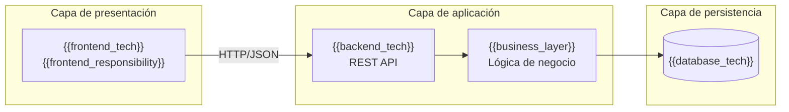
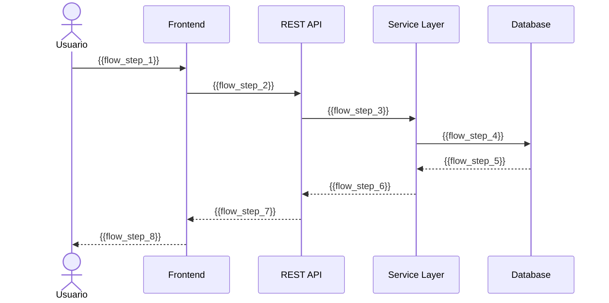
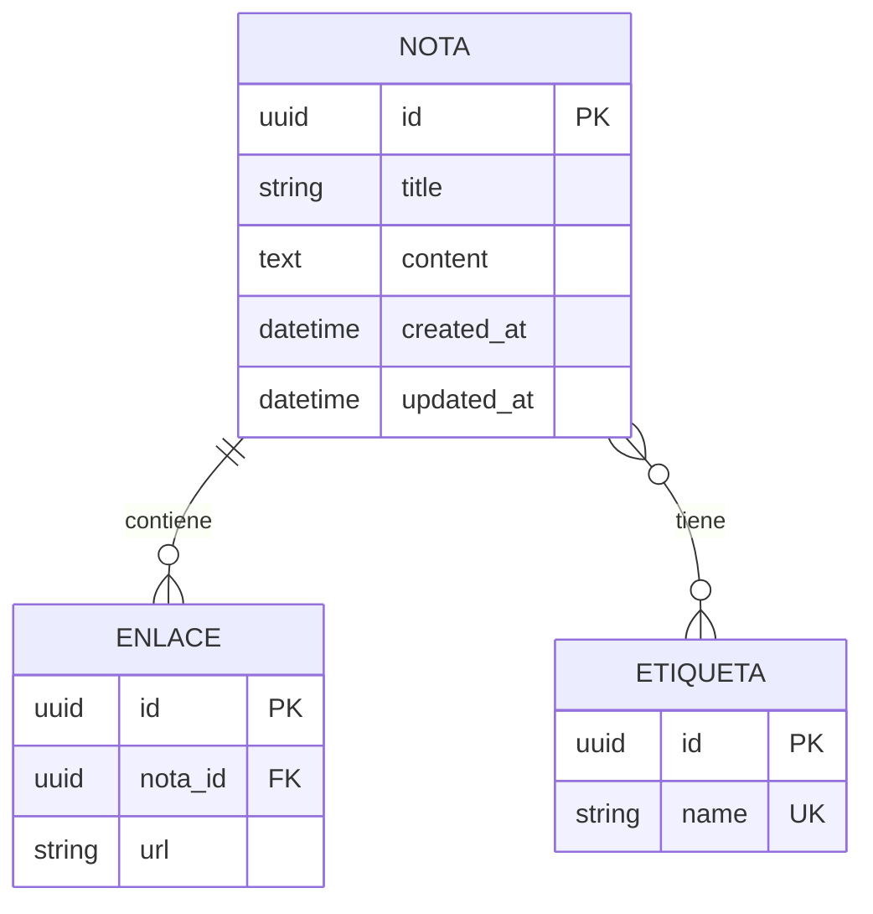
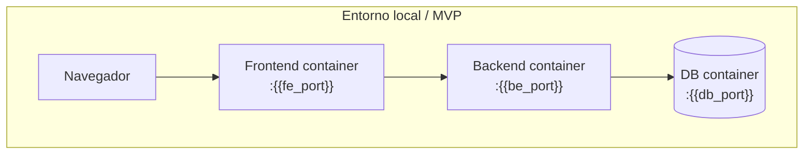

# 🏗 Architecture Overview — {{product_name}}

**Versión:** {{version}}  
**Fuente:** {{input_document}} (PRD / requisitos / roadmap)  
**Autor:** Software Architect Agent  
**Última actualización:** {{last_updated}}

---

## 0. Resumen ejecutivo

{{architecture_summary}}

**Enfoque arquitectónico:** {{architecture_style}}  
**Alcance de este documento:** MVP + consideraciones de evolución futura  
**Principio rector:** Simplicidad primero; escalabilidad solo cuando esté justificada.

---

## 1. High-Level Architecture

### 1.1 Tipo de arquitectura

| Aspecto | Decisión |
|---------|----------|
| **Estilo** | {{architecture_style}} (ej. modular monolith, hexagonal, layered) |
| **Patrón** | {{design_pattern}} (ej. MVC, ports & adapters, clean architecture) |
| **Despliegue MVP** | {{deployment_model}} (ej. 2 contenedores: frontend + backend+DB) |
| **Comunicación** | {{communication_style}} (ej. REST JSON sobre HTTP) |

**Justificación:** {{architecture_justification}}

### 1.2 Diagrama de arquitectura (C4 — Nivel 1: Contexto)

```mermaid
flowchart TB
    User["{{primary_actor}}"]
    App["{{product_name}}"]
    DB[("{{database_name}}")]
    Ext["{{external_system}}"]

    User -->|{{user_interaction}}| App
    App -->|{{persistence_action}}| DB
    App -.->|{{optional_integration}}| Ext
```

### 1.3 Diagrama de componentes (C4 — Nivel 2: Contenedores)



---

## 2. Componentes y responsabilidades

### 2.1 Mapa de componentes

| Componente | Tecnología | Responsabilidad | Entradas | Salidas |
|------------|------------|-----------------|----------|---------|
| {{component_1}} | {{tech_1}} | {{responsibility_1}} | {{input_1}} | {{output_1}} |
| {{component_2}} | {{tech_2}} | {{responsibility_2}} | {{input_2}} | {{output_2}} |
| {{component_3}} | {{tech_3}} | {{responsibility_3}} | {{input_3}} | {{output_3}} |
| {{component_4}} | {{tech_4}} | {{responsibility_4}} | {{input_4}} | {{output_4}} |

### 2.2 Frontend

- **Tecnología:** {{frontend_tech}}
- **Responsabilidad:** {{frontend_responsibility}}
- **Principios:** {{frontend_principles}}
- **No hace:** {{frontend_exclusions}} (ej. acceso directo a BD, lógica de negocio compleja)

### 2.3 Backend / API

- **Tecnología:** {{backend_tech}}
- **Responsabilidad:** {{backend_responsibility}}
- **Capas internas:** {{backend_layers}} (ej. routes → services → repositories)
- **No hace:** {{backend_exclusions}}

### 2.4 Base de datos

- **Tecnología:** {{database_tech}}
- **Responsabilidad:** {{database_responsibility}}
- **Entidades principales:** {{main_entities}}
- **No hace:** {{database_exclusions}}

### 2.5 Integraciones externas (si aplica)

| Integración | Propósito | MVP | Futuro |
|-------------|-----------|-----|--------|
| {{integration_1}} | {{integration_purpose_1}} | {{integration_mvp_1}} | {{integration_future_1}} |

---

## 3. Decisiones técnicas y trade-offs

### 3.1 Stack tecnológico

| Capa | Tecnología elegida | Alternativa descartada | Motivo de la elección |
|------|-------------------|------------------------|------------------------|
| Frontend | {{fe_choice}} | {{fe_alternative}} | {{fe_reason}} |
| Backend | {{be_choice}} | {{be_alternative}} | {{be_reason}} |
| Base de datos | {{db_choice}} | {{db_alternative}} | {{db_reason}} |
| ORM / acceso datos | {{orm_choice}} | {{orm_alternative}} | {{orm_reason}} |
| Testing | {{test_choice}} | {{test_alternative}} | {{test_reason}} |
| Contenedores | {{docker_choice}} | {{docker_alternative}} | {{docker_reason}} |

### 3.2 Trade-offs explícitos

| Decisión | Beneficio | Coste / sacrificio | Por qué se acepta |
|----------|-----------|-------------------|-------------------|
| {{decision_1}} | {{benefit_1}} | {{cost_1}} | {{why_accepted_1}} |
| {{decision_2}} | {{benefit_2}} | {{cost_2}} | {{why_accepted_2}} |
| {{decision_3}} | {{benefit_3}} | {{cost_3}} | {{why_accepted_3}} |

### 3.3 Por qué NO otras alternativas

| Alternativa | Por qué se descarta |
|-------------|---------------------|
| Microservicios | {{why_not_microservices}} |
| {{alternative_2}} | {{why_not_2}} |
| {{alternative_3}} | {{why_not_3}} |

---

## 4. Diseño de API (REST)

### 4.1 Principios

- Recursos nombrados en plural y en minúsculas: `/notas`, `/etiquetas`
- Versionado: {{api_versioning}} (ej. `/api/v1/...`)
- Códigos HTTP estándar: 200, 201, 400, 404, 500
- Errores estructurados: `{ "error": { "code", "message", "details" } }`
- Paginación: {{pagination_strategy}} (ej. `?page=1&limit=20`)

### 4.2 Endpoints MVP

| Método | Endpoint | Descripción | Request body | Response |
|--------|----------|-------------|--------------|----------|
| GET | `/api/v1/notas` | {{endpoint_1_desc}} | — | {{endpoint_1_response}} |
| GET | `/api/v1/notas/:id` | {{endpoint_2_desc}} | — | {{endpoint_2_response}} |
| POST | `/api/v1/notas` | {{endpoint_3_desc}} | {{endpoint_3_request}} | {{endpoint_3_response}} |
| PUT | `/api/v1/notas/:id` | {{endpoint_4_desc}} | {{endpoint_4_request}} | {{endpoint_4_response}} |
| DELETE | `/api/v1/notas/:id` | {{endpoint_5_desc}} | — | {{endpoint_5_response}} |
| GET | `/api/v1/notas?etiqueta={nombre}` | {{endpoint_6_desc}} | — | {{endpoint_6_response}} |
| GET | `/api/v1/buscar?q={term}` | {{endpoint_7_desc}} | — | {{endpoint_7_response}} |

### 4.3 Contrato de ejemplo

**POST /api/v1/notas**

```json
// Request
{
  "title": "{{example_title}}",
  "content": "{{example_content}}",
  "links": ["{{example_url}}"],
  "tags": ["{{example_tag}}"]
}

// Response 201
{
  "id": "{{example_id}}",
  "title": "{{example_title}}",
  "content": "{{example_content}}",
  "links": ["{{example_url}}"],
  "tags": ["{{example_tag}}"],
  "createdAt": "{{example_timestamp}}",
  "updatedAt": "{{example_timestamp}}"
}
```

---

## 5. Flujo de datos

### 5.1 Flujo crítico: {{critical_flow_name}} (ej. Crear nota)



### 5.2 Flujos principales

| Flujo | Ruta | Componentes involucrados | SLA (PRD) |
|-------|------|--------------------------|-----------|
| {{flow_1}} | {{flow_1_path}} | {{flow_1_components}} | {{flow_1_sla}} |
| {{flow_2}} | {{flow_2_path}} | {{flow_2_components}} | {{flow_2_sla}} |
| {{flow_3}} | {{flow_3_path}} | {{flow_3_components}} | {{flow_3_sla}} |

### 5.3 Reglas de acoplamiento

- El frontend **solo** consume la API REST; nunca accede a la BD.
- La lógica de negocio reside en la **capa de servicios** del backend.
- El acceso a datos se concentra en **repositorios**; sin SQL en controladores.
- DTOs / schemas validan entrada y salida en los límites de la API.

---

## 6. Modelo de datos (vista arquitectónica)

> Detalle completo en documento de modelo de datos. Aquí: vista de alto nivel para arquitectura.



| Entidad | Relaciones | Notas de diseño |
|---------|------------|-----------------|
| {{entity_1}} | {{entity_1_relations}} | {{entity_1_notes}} |
| {{entity_2}} | {{entity_2_relations}} | {{entity_2_notes}} |
| {{entity_3}} | {{entity_3_relations}} | {{entity_3_notes}} |

---

## 7. Estructura del proyecto

### 7.1 Árbol de directorios

```
{{project_root}}/
├── {{frontend_dir}}/
│   ├── {{fe_structure}}
│   └── ...
├── {{backend_dir}}/
│   ├── {{be_structure}}
│   └── ...
├── {{shared_dir}}/          # opcional: tipos/contratos compartidos
├── {{infra_dir}}/           # docker, scripts de despliegue
│   ├── docker-compose.yml
│   └── ...
├── 01-knowledge/
├── 02-docs/
│   ├── product/
│   └── architecture/
├── 04-prompts/
├── src/
├── tests/
├── 03-delivery/
└── README.md
```

### 7.2 Convenciones por capa

| Capa | Carpeta | Contenido |
|------|---------|-----------|
| Frontend | `{{fe_src}}` | Componentes, páginas, hooks, servicios API |
| Backend | `{{be_routes}}` | Rutas / controladores HTTP |
| Backend | `{{be_services}}` | Lógica de negocio |
| Backend | `{{be_repos}}` | Acceso a persistencia |
| Backend | `{{be_models}}` | Modelos / entidades / schemas |
| Infra | `{{infra_path}}` | Docker, migraciones, seeds |

---

## 8. Requisitos no funcionales (mapeo)

| RNF (PRD) | Requisito | Cómo lo cumple la arquitectura |
|-----------|-----------|--------------------------------|
| RNF-001 | CRUD < 2 s | {{nfr_001_solution}} |
| RNF-002 | Búsqueda < 300 ms | {{nfr_002_solution}} |
| RNF-004 | Persistencia consistente | {{nfr_004_solution}} |
| RNF-005 | Modelo extensible | {{nfr_005_solution}} |
| RNF-006 | Acceso vía API | {{nfr_006_solution}} |
| RNF-008 | Validación de entrada | {{nfr_008_solution}} |

---

## 9. Seguridad

| Aspecto | MVP | Futuro |
|---------|-----|--------|
| Autenticación | {{auth_mvp}} | {{auth_future}} |
| Autorización | {{authz_mvp}} | {{authz_future}} |
| Validación de entrada | {{input_validation}} | — |
| XSS / inyección | {{xss_protection}} | — |
| HTTPS | {{https_strategy}} | — |
| CORS | {{cors_policy}} | — |

---

## 10. Infraestructura y despliegue

### 10.1 Entornos

| Entorno | Propósito | Componentes |
|---------|-----------|-------------|
| Local | Desarrollo | {{local_stack}} |
| Staging | Pruebas pre-release | {{staging_stack}} |
| Producción | Usuarios finales | {{prod_stack}} |

### 10.2 Diagrama de despliegue



### 10.3 Proceso de despliegue MVP

1. {{deploy_step_1}}
2. {{deploy_step_2}}
3. {{deploy_step_3}}

---

## 11. Estrategia de testing (arquitectura)

| Tipo | Alcance | Herramientas | Qué valida |
|------|---------|--------------|------------|
| Unitarios | Services, utils | {{unit_test_tools}} | Lógica de negocio aislada |
| Integración | API + BD | {{integration_test_tools}} | Contratos y persistencia |
| E2E | Flujos de usuario | {{e2e_test_tools}} | Criterios Gherkin del roadmap |
| Rendimiento | Búsqueda, CRUD | {{perf_test_tools}} | RNF-001, RNF-002 |

---

## 12. MVP vs evolución futura

### 12.1 Alcance MVP (arquitectura)

- {{mvp_arch_1}}
- {{mvp_arch_2}}
- {{mvp_arch_3}}

### 12.2 Extensiones planificadas (sin romper el núcleo)

| Capacidad futura | Impacto arquitectónico | Preparación en MVP |
|------------------|------------------------|-------------------|
| Backlinks | {{backlinks_impact}} | {{backlinks_prep}} |
| Grafo de conocimiento | {{graph_impact}} | {{graph_prep}} |
| Plugins | {{plugins_impact}} | {{plugins_prep}} |
| Multi-usuario / Auth | {{auth_impact}} | {{auth_prep}} |

---

## 13. Riesgos técnicos

| Riesgo | Probabilidad | Impacto | Mitigación |
|--------|--------------|---------|------------|
| {{tech_risk_1}} | {{prob_1}} | {{impact_1}} | {{mitigation_1}} |
| {{tech_risk_2}} | {{prob_2}} | {{impact_2}} | {{mitigation_2}} |
| {{tech_risk_3}} | {{prob_3}} | {{impact_3}} | {{mitigation_3}} |

---

## 14. ADRs (Architecture Decision Records)

### ADR-001: {{adr_1_title}}

- **Estado:** {{adr_1_status}}
- **Contexto:** {{adr_1_context}}
- **Decisión:** {{adr_1_decision}}
- **Consecuencias:** {{adr_1_consequences}}

### ADR-002: {{adr_2_title}}

- **Estado:** {{adr_2_status}}
- **Contexto:** {{adr_2_context}}
- **Decisión:** {{adr_2_decision}}
- **Consecuencias:** {{adr_2_consequences}}

---

## Guía para el agente generador

Al rellenar esta plantilla:

1. **Derivar del PRD y roadmap:** Usar RF/RNF, épicas y tasks como fuente; distinguir MVP de futuro.
2. **Simplicidad:** Modular monolith o layered architecture para MVP; no microservicios sin justificación.
3. **Diagramas:** Incluir al menos diagrama de contexto, componentes y un sequence diagram del flujo crítico.
4. **API:** Documentar todos los endpoints MVP alineados con las tasks `[BE]` del roadmap.
5. **Trade-offs:** Cada decisión técnica debe incluir alternativa descartada y motivo.
6. **Extensibilidad:** Documentar cómo el diseño soporta backlinks/plugins sin over-engineering en MVP.
7. **Sin placeholders:** Sustituir todos los `{{...}}` antes de finalizar.
8. **No incluir esta sección** en el documento de salida (`HLD-v1.md`).

### Anti-patrones a evitar

- Microservicios para un MVP single-user
- Lógica de negocio en el frontend
- Endpoints RPC en lugar de recursos REST (`/crearNota` ❌)
- Diagramas genéricos sin relación con el producto
- Omitir mapeo de RNF del PRD
- Stack tecnológico sin justificación
