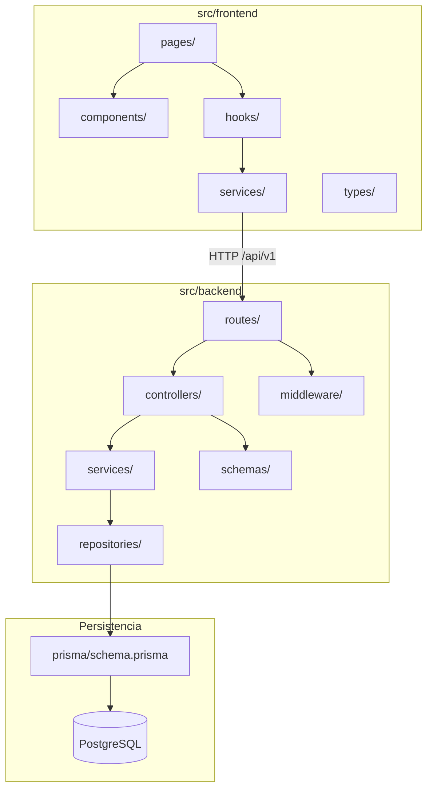
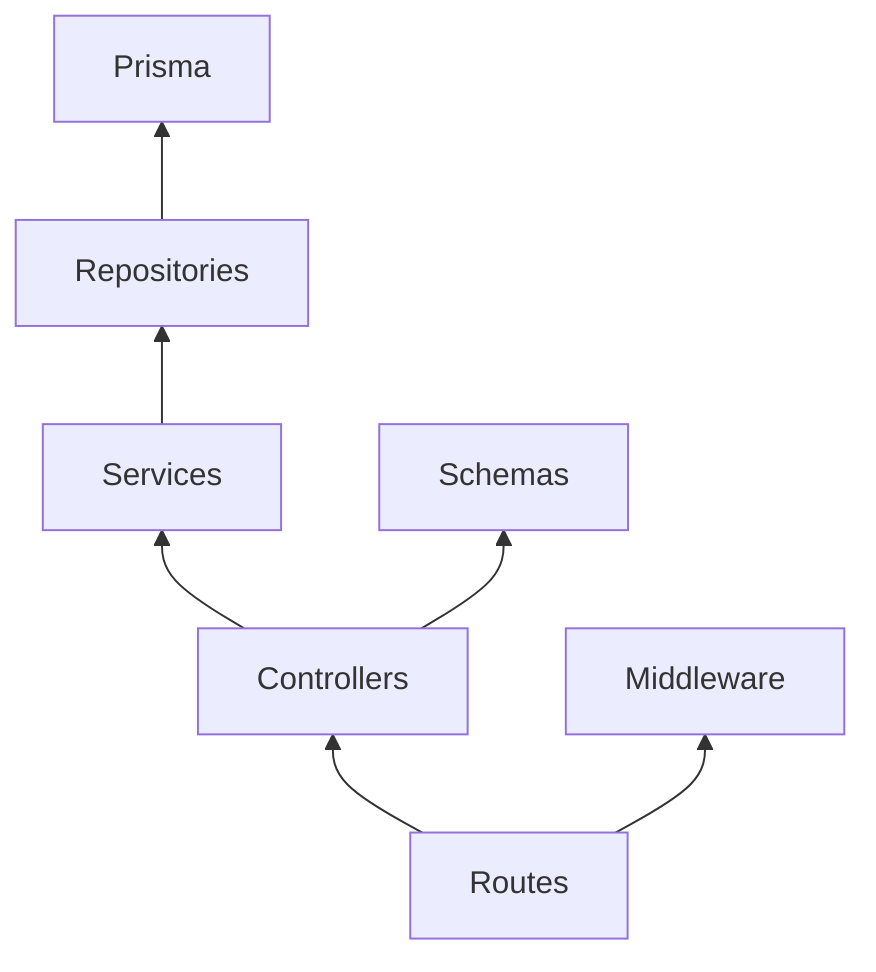
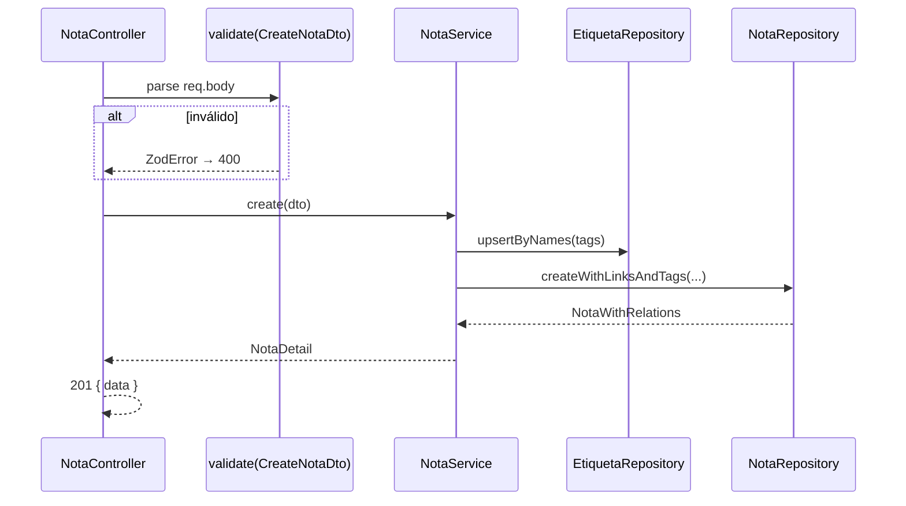
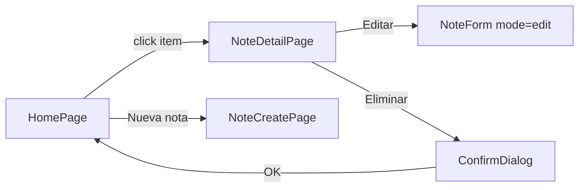
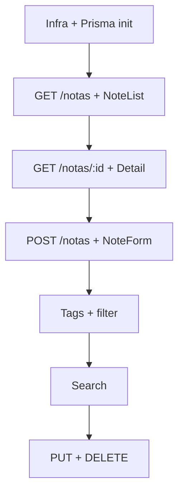

# 🔧 Low Level Design (LLD) — {{product_name}}

**Versión:** {{version}}  
**Fuente:** {{input_hld}} (HLD), {{input_data_model}} (modelo de datos)  
**Autor:** LLD Architect Agent  
**Última actualización:** {{last_updated}}

---

## 0. Resumen ejecutivo

{{lld_summary}}

| Aspecto | Decisión |
|---------|----------|
| **Alcance** | MVP — detalle implementable en `src/` |
| **Patrón backend** | {{backend_pattern}} (ej. routes → controllers → services → repositories) |
| **Patrón frontend** | {{frontend_pattern}} (ej. pages → components → services/hooks) |
| **Validación** | {{validation_approach}} (ej. Zod en límites HTTP) |
| **ORM / migraciones** | {{orm_migrations}} |

**Relación con documentos superiores:**

| Documento | Qué aporta al LLD | Qué NO duplica el LLD |
|-----------|-------------------|----------------------|
| HLD | Componentes, API de alto nivel, NFR, despliegue | Decisiones estratégicas ya cerradas |
| Modelo de datos | Entidades, DDL, Prisma, índices | Catálogo físico de tablas |
| **LLD (este doc)** | Módulos, clases/archivos, DTOs, flujos por capa, trazabilidad a US/TASK | Código fuente |

---

## 1. Mapa de módulos del sistema

### 1.1 Vista de módulos (backend + frontend)



### 1.2 Responsabilidad por capa (backend)

| Capa | Carpeta | Responsabilidad | Puede | No puede |
|------|---------|-----------------|-------|----------|
| Routes | `routes/` | Registrar endpoints, aplicar middleware | Delegar en controller | Lógica de negocio, Prisma directo |
| Controllers | `controllers/` | HTTP ↔ DTO, códigos de estado | Llamar services, formatear respuesta | Queries SQL, reglas de dominio |
| Services | `services/` | Reglas de negocio, orquestación | Usar repositories, lanzar errores de dominio | Conocer `req`/`res` de Express |
| Repositories | `repositories/` | Acceso Prisma, mapeo entidad | Queries optimizadas | Validación HTTP, reglas de negocio |
| Schemas | `schemas/` | Zod: request/response DTOs | Exportar tipos inferidos | Lógica de aplicación |
| Middleware | `middleware/` | Errores globales, validación body | `next(error)` tipado | Lógica de dominio |

### 1.3 Responsabilidad por capa (frontend)

| Capa | Carpeta | Responsabilidad | Puede | No puede |
|------|---------|-----------------|-------|----------|
| Pages | `pages/` | Composición de pantallas, routing | Orquestar hooks y componentes | Fetch directo sin service |
| Components | `components/` | UI reutilizable, eventos | Llamar callbacks del padre | Acceso HTTP directo |
| Hooks | `hooks/` | Estado local, efectos, llamadas API | Usar `services/` | Lógica de persistencia |
| Services | `services/` | Cliente HTTP, mapeo errores API | `fetch` / axios configurado | Reglas de negocio del servidor |
| Types | `types/` | DTOs TypeScript alineados con API | Tipos compartidos UI | Duplicar validación Zod del backend |

---

## 2. Estructura de directorios y archivos

### 2.1 Árbol backend (`src/backend/`)

```
src/backend/
├── src/
│   ├── app.ts                    # Express app, middleware global, mount routes
│   ├── server.ts                 # Bootstrap HTTP
│   ├── routes/
│   │   ├── index.ts              # Router raíz /api/v1
│   │   ├── notas.routes.ts       # {{notas_routes_desc}}
│   │   ├── buscar.routes.ts      # {{buscar_routes_desc}}
│   │   └── etiquetas.routes.ts   # {{etiquetas_routes_desc}}
│   ├── controllers/
│   │   ├── nota.controller.ts
│   │   ├── search.controller.ts
│   │   └── etiqueta.controller.ts
│   ├── services/
│   │   ├── nota.service.ts
│   │   ├── etiqueta.service.ts
│   │   └── search.service.ts
│   ├── repositories/
│   │   ├── nota.repository.ts
│   │   └── etiqueta.repository.ts
│   ├── schemas/
│   │   ├── nota.schema.ts        # CreateNota, UpdateNota, NotaResponse
│   │   ├── search.schema.ts
│   │   └── common.schema.ts      # ErrorResponse, PaginationMeta
│   ├── middleware/
│   │   ├── errorHandler.ts
│   │   └── validate.ts           # validateBody(schema)
│   ├── lib/
│   │   └── prisma.ts             # Singleton PrismaClient
│   └── errors/
│       ├── AppError.ts
│       └── errorCodes.ts
├── prisma/
│   ├── schema.prisma
│   ├── migrations/
│   └── seed.ts                   # opcional desarrollo
├── package.json
└── tsconfig.json
```

### 2.2 Árbol frontend (`src/frontend/`)

```
src/frontend/
├── src/
│   ├── main.tsx
│   ├── App.tsx                   # Router principal
│   ├── pages/
│   │   ├── HomePage.tsx          # Listado + búsqueda + filtros
│   │   ├── NoteDetailPage.tsx    # Detalle / edición
│   │   └── NoteCreatePage.tsx    # Crear nota (o modal en Home)
│   ├── components/
│   │   ├── notes/
│   │   │   ├── NoteList.tsx
│   │   │   ├── NoteListItem.tsx
│   │   │   ├── NoteDetail.tsx
│   │   │   ├── NoteForm.tsx
│   │   │   └── EmptyState.tsx
│   │   ├── tags/
│   │   │   ├── TagInput.tsx
│   │   │   └── TagFilter.tsx
│   │   ├── search/
│   │   │   ├── SearchBar.tsx
│   │   │   └── SearchEmptyState.tsx
│   │   └── common/
│   │       ├── ConfirmDialog.tsx
│   │       └── ErrorMessage.tsx
│   ├── hooks/
│   │   ├── useNotes.ts
│   │   ├── useNote.ts
│   │   └── useSearch.ts
│   ├── services/
│   │   ├── apiClient.ts          # base URL, headers, error parsing
│   │   ├── notesApi.ts
│   │   ├── searchApi.ts
│   │   └── tagsApi.ts
│   └── types/
│       ├── nota.ts
│       └── api.ts
├── package.json
└── vite.config.ts
```

### 2.3 Infraestructura (`src/infra/`)

| Archivo | Propósito |
|---------|-----------|
| `docker-compose.yml` | Servicios: frontend, backend, postgres |
| `Dockerfile.backend` | Build multi-stage Node |
| `Dockerfile.frontend` | Build Vite + Nginx |
| `.env.example` | Variables: `DATABASE_URL`, `PORT`, `VITE_API_URL` |

---

## 3. Contratos entre capas (backend)

### 3.1 Interfaces de servicios

```typescript
// Ejemplo: NotaService — contrato que debe implementar nota.service.ts
interface NotaService {
  list(params: ListNotasParams): Promise<NotaResumen[]>;
  getById(id: string): Promise<NotaDetail>;
  create(dto: CreateNotaDto): Promise<NotaDetail>;
  update(id: string, dto: UpdateNotaDto): Promise<NotaDetail>;
  delete(id: string): Promise<void>;
  removeTag(notaId: string, tagId: string): Promise<void>; // V1
}
```

| Servicio | Métodos públicos | Depende de |
|----------|------------------|------------|
| `NotaService` | {{nota_service_methods}} | `NotaRepository`, `EtiquetaRepository` |
| `EtiquetaService` | {{etiqueta_service_methods}} | `EtiquetaRepository` |
| `SearchService` | {{search_service_methods}} | `NotaRepository` |

### 3.2 Interfaces de repositorios

```typescript
// Ejemplo: NotaRepository — única capa con Prisma
interface NotaRepository {
  findAll(filters: NotaFilters): Promise<NotaWithRelations[]>;
  findById(id: string): Promise<NotaWithRelations | null>;
  create(data: CreateNotaData): Promise<NotaWithRelations>;
  update(id: string, data: UpdateNotaData): Promise<NotaWithRelations>;
  delete(id: string): Promise<void>;
  search(term: string, order: SearchOrder): Promise<NotaWithRelations[]>;
}
```

### 3.3 Diagrama de dependencias (backend)



**Regla:** las dependencias solo apuntan hacia abajo; repositories no importan services ni controllers.

---

## 4. API — detalle de implementación

> Complementa HLD §4 con schemas Zod, handlers y códigos de error por endpoint.

### 4.1 Envelope de respuesta

| Caso | Formato | HTTP |
|------|---------|------|
| Éxito con datos | `{ "data": T }` o `{ "data": T[], "meta": {...} }` | 200 / 201 |
| Sin contenido | cuerpo vacío | 204 |
| Error validación | `{ "error": { "code", "message", "details": [{ field, message }] } }` | 400 |
| No encontrado | `{ "error": { "code": "NOT_FOUND", "message" } }` | 404 |
| Error interno | `{ "error": { "code": "INTERNAL_ERROR", "message" } }` | 500 |

### 4.2 Catálogo de endpoints MVP

| Método | Ruta | Controller | Service | Schema request | Schema response | US / TASK |
|--------|------|------------|---------|----------------|-----------------|-----------|
| GET | `/api/v1/notas` | `listNotas` | `NotaService.list` | query `ListNotasQuery` | `NotaResumen[]` | US-001, TASK-001 |
| GET | `/api/v1/notas/:id` | `getNota` | `NotaService.getById` | params `IdParam` | `NotaDetail` | US-002, TASK-005 |
| POST | `/api/v1/notas` | `createNota` | `NotaService.create` | `CreateNotaDto` | `NotaDetail` | US-005, TASK-017 |
| PUT | `/api/v1/notas/:id` | `updateNota` | `NotaService.update` | `UpdateNotaDto` | `NotaDetail` | US-015, TASK-057 |
| DELETE | `/api/v1/notas/:id` | `deleteNota` | `NotaService.delete` | params `IdParam` | — | US-016, TASK-061 |
| GET | `/api/v1/notas?etiqueta=` | `listNotas` | `NotaService.list` | query | `NotaResumen[]` | US-009, TASK-033 |
| GET | `/api/v1/buscar` | `searchNotas` | `SearchService.search` | `SearchQuery` | `NotaResumen[]` | US-012, TASK-045 |
| DELETE | `/api/v1/notas/:id/etiquetas/:tagId` | `removeTag` | `NotaService.removeTag` | params | — | US-010 V1 |

### 4.3 DTOs y schemas Zod (ejemplo)

```typescript
// schemas/nota.schema.ts
export const CreateNotaDto = z.object({
  title: z.string().min(1, "El título es obligatorio").max(500),
  content: z.string().min(1, "El contenido es obligatorio"),
  links: z.array(z.string().url("URL con formato inválido")).default([]),
  tags: z.array(z.string().min(1)).default([]),
});

export const NotaDetailResponse = z.object({
  id: z.string().uuid(),
  title: z.string(),
  content: z.string(),
  links: z.array(z.string().url()),
  tags: z.array(z.string()),
  createdAt: z.string().datetime(),
  updatedAt: z.string().datetime(),
});
```

| DTO | Campos | Validaciones clave | Trazabilidad |
|-----|--------|-------------------|--------------|
| `CreateNotaDto` | title, content, links, tags | title/content NOT empty; URL válida | US-005, US-006, US-007 |
| `UpdateNotaDto` | Partial de Create | Mismas reglas si presentes | US-015 |
| `ListNotasQuery` | etiqueta?, sort?, order? | enum sort/order | US-004, US-009 |
| `SearchQuery` | q, order? | q min 1 char; order relevance\|date | US-012, US-013 |

### 4.4 Mapeo persistencia ↔ API

| Campo DB (`snake_case`) | Campo JSON (`camelCase`) | Transformación |
|------------------------|--------------------------|----------------|
| `created_at` | `createdAt` | ISO 8601 UTC en serializer |
| `updated_at` | `updatedAt` | ISO 8601 UTC; refresh en UPDATE |
| `nota_etiqueta` | `tags: string[]` | JOIN → nombres de etiqueta |
| `enlaces.url` | `links: string[]` | Orden estable por id |

---

## 5. Lógica de negocio por servicio

### 5.1 NotaService

| Operación | Pasos | Reglas | Errores |
|-----------|-------|--------|---------|
| `create` | Validar DTO → upsert etiquetas por nombre → crear nota + enlaces + M:N | Etiquetas auto-creadas; trim nombres; URLs únicas por nota | `VALIDATION_ERROR` 400 |
| `update` | Cargar nota → merge etiquetas/enlaces → persistir → refresh `updatedAt` | Transacción Prisma | `NOT_FOUND` 404 |
| `delete` | Verificar existe → DELETE cascade enlaces y nota_etiqueta | Irreversible (sin soft-delete) | `NOT_FOUND` 404 |
| `list` | Aplicar filtro etiqueta, sort, order | Default: `created_at DESC` | — |
| `removeTag` | DELETE fila nota_etiqueta | No borrar etiqueta global | `NOT_FOUND` 404 |

### 5.2 SearchService

| Operación | Algoritmo MVP | Índices | SLA |
|-----------|---------------|---------|-----|
| `search` | `ILIKE %term%` en title y content; score: título > contenido | btree title; seq scan content aceptable < 500 notas | < 300 ms RNF-002 |

### 5.3 Diagrama de secuencia — Crear nota (detalle LLD)



---

## 6. Capa de persistencia y migraciones

### 6.1 Estrategia Prisma

| Aspecto | Decisión |
|---------|----------|
| Cliente | Singleton en `lib/prisma.ts`; disconnect en shutdown |
| Migraciones | `prisma migrate dev` local; `prisma migrate deploy` en CI/prod |
| Seeds | `prisma/seed.ts` — 10–20 notas de demo para desarrollo |
| Transacciones | `prisma.$transaction` en create/update con etiquetas y enlaces |

### 6.2 Orden de migraciones MVP

| # | Migración | Tablas | TASK |
|---|-----------|--------|------|
| 1 | `init_notas` | `notas` | TASK-019 |
| 2 | `add_enlaces` | `enlaces` | TASK-023 |
| 3 | `add_etiquetas` | `etiquetas`, `nota_etiqueta` | TASK-031 |
| 4 | `add_indexes` | índices RNF-002 | TASK-003, TASK-035, TASK-047 |

### 6.3 Queries críticas (referencia repository)

| Método repository | Query / Prisma | Índice usado |
|-------------------|----------------|--------------|
| `findAll` | `nota.findMany({ orderBy, include })` | `created_at` |
| `findById` | `nota.findUnique({ include: { enlaces, etiquetas } })` | PK |
| `search` | `findMany({ where: { OR: [title, content] } })` | title btree |
| `filterByTag` | `where: { etiquetas: { some: { name } } }` | nota_etiqueta |

---

## 7. Frontend — diseño de componentes y estado

### 7.1 Mapa página → componentes → API

| Página | Componentes | Hook / Service | User Story |
|--------|-------------|----------------|------------|
| `HomePage` | `NoteList`, `SearchBar`, `TagFilter`, `EmptyState` | `useNotes`, `useSearch` | US-001, US-009, US-012 |
| `NoteDetailPage` | `NoteDetail`, `NoteForm`, `ConfirmDialog` | `useNote` | US-002, US-015, US-016 |
| `NoteCreatePage` | `NoteForm`, `TagInput` | `notesApi.create` | US-005, US-006, US-008 |

### 7.2 Estado y navegación

| Concern | Enfoque MVP |
|---------|-------------|
| Routing | React Router: `/`, `/notas/:id`, `/notas/nueva` |
| Estado servidor | Hooks con `useState` + `useEffect`; sin Redux en MVP |
| Errores API | `apiClient` parsea `error.details` → props en `NoteForm` |
| Loading | Flags `isLoading` / `isSaving` por hook |

### 7.3 Diagrama de flujo UI — Listado → Detalle



---

## 8. Manejo de errores y observabilidad

### 8.1 Jerarquía de errores (backend)

| Clase | code | HTTP | Cuándo |
|-------|------|------|--------|
| `ValidationError` | `VALIDATION_ERROR` | 400 | Zod / reglas de entrada |
| `NotFoundError` | `NOT_FOUND` | 404 | id inexistente |
| `AppError` | custom | 4xx/5xx | Dominio |
| default | `INTERNAL_ERROR` | 500 | No capturado |

### 8.2 Middleware `errorHandler`

- Log estructurado: `{ level, message, code, path, requestId }`
- En producción: no exponer stack trace al cliente
- Mapear `ZodError` → `details[]` con `field` path

### 8.3 Logging MVP

| Evento | Nivel | Campos |
|--------|-------|--------|
| Request entrante | info | method, path, durationMs |
| Error 5xx | error | stack, requestId |
| Query lenta > 500ms | warn | operation, durationMs |

---

## 9. Trazabilidad roadmap → código

### 9.1 Historias MVP → módulos

| US | Backend | Frontend | Tests |
|----|---------|----------|-------|
| US-001 | `nota.routes`, `nota.repository.findAll` | `NoteList`, `HomePage` | E2E listado |
| US-002 | `GET /notas/:id` | `NoteDetailPage` | E2E navegación |
| US-005 | `POST /notas`, `CreateNotaDto` | `NoteForm` | E2E creación |
| US-008 | `EtiquetaService.upsert` | `TagInput` | integración tags |
| US-012 | `SearchService` | `SearchBar` | benchmark 300ms |
| US-015 | `PUT /notas/:id` | `NoteForm` edit | E2E edición |
| US-016 | `DELETE /notas/:id` | `ConfirmDialog` | E2E delete |

### 9.2 Orden de implementación sugerido



---

## 10. Testing (alineación LLD)

| Capa | Qué testear | Herramienta | Ubicación |
|------|-------------|-------------|-----------|
| Schemas | DTOs válidos/inválidos | Vitest/Jest | `src/backend/src/schemas/*.test.ts` |
| Services | Reglas negocio mock repo | Vitest + mocks | `src/backend/src/services/*.test.ts` |
| API | Contratos HTTP + BD test | Supertest + Prisma test DB | `tests/integration/` |
| E2E | Gherkin US-001…016 | Playwright | `tests/e2e/` |

---

## 11. Configuración y variables de entorno

| Variable | Entorno | Ejemplo | Consumidor |
|----------|---------|---------|------------|
| `DATABASE_URL` | backend | `postgresql://user:pass@db:5432/okc` | Prisma |
| `PORT` | backend | `3000` | Express |
| `NODE_ENV` | backend | `development` | errorHandler |
| `VITE_API_URL` | frontend build | `http://localhost:3000/api/v1` | apiClient |
| `CORS_ORIGIN` | backend | `http://localhost:5173` | cors middleware |

---

## 12. MVP vs diferido (V1 / V2+)

| Capacidad | MVP (este LLD) | V1 | V2+ |
|-----------|----------------|-----|-----|
| Empty state | componente básico | `EmptyState` completo US-003 | — |
| Validación inline FE | mensajes API | validación cliente US-007 | — |
| Quitar etiqueta | — | `DELETE .../etiquetas/:tagId` | — |
| Ordenación listado | — | — | query sort US-004 |
| Catálogo etiquetas | — | — | `GET /etiquetas` US-011 |
| Backlinks | — | — | tabla `nota_backlink` US-017 |

---

## 13. Riesgos de implementación

| Riesgo | Mitigación en LLD |
|--------|------------------|
| N+1 en detalle con tags/links | `include` Prisma en una query |
| Búsqueda lenta > 500 notas | índice + benchmark en TASK-048 |
| Duplicar validación FE/BE | Zod backend fuente de verdad; FE opcional V1 |
| Migraciones divergentes | Un PR = una migración; alinear con logical-model |

---

## Guía para el agente generador

Al rellenar esta plantilla:

1. **Derivar del HLD y modelo de datos:** No reabrir decisiones de stack; bajar a archivos, métodos y DTOs.
2. **Trazabilidad:** Cada endpoint y componente principal debe referenciar US-XXX o TASK-XXX del roadmap.
3. **Implementable:** Un desarrollador debe poder crear `src/` siguiendo solo este documento + logical-model.
4. **Zod obligatorio:** Todo body/query de entrada documentado con schema y mensajes en español.
5. **Sin placeholders:** Sustituir todos los `{{...}}` antes de finalizar.
6. **No incluir esta sección** en el documento de salida (`LLD-v1.md`).

### Anti-patrones a evitar

- Lógica Prisma en controllers o routes
- DTOs distintos entre OpenAPI, Zod y types TS sin justificación
- Componentes frontend que llaman `fetch` sin pasar por `services/`
- Omitir mapeo snake_case ↔ camelCase
- Incluir backlinks o auth en módulos MVP
