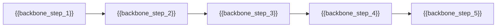

# 🗺 User Story Map — {{product_name}}

**Versión:** {{version}}  
**Fuente:** {{input_document}} (PRD / requisitos)  
**Persona principal:** {{primary_persona}}

---

## 0. Visión del mapa

{{map_vision}}

> El User Story Map organiza el producto en **tres niveles** (método Jeff Patton):
> 1. **Backbone** — fases del viaje del usuario (horizontal, orden temporal)
> 2. **Activities** — acciones concretas dentro de cada fase
> 3. **Stories** — historias de usuario priorizadas en **slices verticales** (MVP → V1 → V2+)

---

## 1. Backbone (User Journey)

Orden de izquierda a derecha = flujo natural del usuario.

| # | Fase del viaje | Objetivo del usuario en esta fase |
|---|----------------|-----------------------------------|
| 1 | {{backbone_step_1}} | {{backbone_goal_1}} |
| 2 | {{backbone_step_2}} | {{backbone_goal_2}} |
| 3 | {{backbone_step_3}} | {{backbone_goal_3}} |
| 4 | {{backbone_step_4}} | {{backbone_goal_4}} |
| 5 | {{backbone_step_5}} | {{backbone_goal_5}} |

### Diagrama del backbone

---

## 2. Story Mapping

> **Reglas de redacción (INVEST):** Independiente · Negociable · Valiosa · Estimable · Pequeña · Testeable  
> **Formato obligatorio:** *Como* [usuario], *quiero* [acción], *para* [valor/beneficio]

---

### 2.1 {{backbone_step_1}}

#### Activities
- {{activity_1_1}}
- {{activity_1_2}}

#### User Stories

| ID | Prioridad | Historia de usuario | Criterios de aceptación (resumen) |
|----|-----------|---------------------|-----------------------------------|
| US-001 | MVP | Como {{user}}, quiero {{action}}, para {{value}}. | {{acceptance_criteria_1}} |
| US-002 | MVP | Como {{user}}, quiero {{action}}, para {{value}}. | {{acceptance_criteria_2}} |
| US-003 | V1 | Como {{user}}, quiero {{action}}, para {{value}}. | {{acceptance_criteria_3}} |
| US-004 | V2+ | Como {{user}}, quiero {{action}}, para {{value}}. | {{acceptance_criteria_4}} |

---

### 2.2 {{backbone_step_2}}

#### Activities
- {{activity_2_1}}
- {{activity_2_2}}

#### User Stories

| ID | Prioridad | Historia de usuario | Criterios de aceptación (resumen) |
|----|-----------|---------------------|-----------------------------------|
| US-005 | MVP | Como {{user}}, quiero {{action}}, para {{value}}. | {{acceptance_criteria_5}} |
| US-006 | MVP | Como {{user}}, quiero {{action}}, para {{value}}. | {{acceptance_criteria_6}} |
| US-007 | V1 | Como {{user}}, quiero {{action}}, para {{value}}. | {{acceptance_criteria_7}} |

---

### 2.3 {{backbone_step_3}}

#### Activities
- {{activity_3_1}}
- {{activity_3_2}}

#### User Stories

| ID | Prioridad | Historia de usuario | Criterios de aceptación (resumen) |
|----|-----------|---------------------|-----------------------------------|
| US-008 | MVP | Como {{user}}, quiero {{action}}, para {{value}}. | {{acceptance_criteria_8}} |
| US-009 | MVP | Como {{user}}, quiero {{action}}, para {{value}}. | {{acceptance_criteria_9}} |
| US-010 | V2+ | Como {{user}}, quiero {{action}}, para {{value}}. | {{acceptance_criteria_10}} |

---

### 2.4 {{backbone_step_4}}

#### Activities
- {{activity_4_1}}
- {{activity_4_2}}

#### User Stories

| ID | Prioridad | Historia de usuario | Criterios de aceptación (resumen) |
|----|-----------|---------------------|-----------------------------------|
| US-011 | MVP | Como {{user}}, quiero {{action}}, para {{value}}. | {{acceptance_criteria_11}} |
| US-012 | V1 | Como {{user}}, quiero {{action}}, para {{value}}. | {{acceptance_criteria_12}} |

---

### 2.5 {{backbone_step_5}} *(opcional)*

#### Activities
- {{activity_5_1}}

#### User Stories

| ID | Prioridad | Historia de usuario | Criterios de aceptación (resumen) |
|----|-----------|---------------------|-----------------------------------|
| US-013 | V2+ | Como {{user}}, quiero {{action}}, para {{value}}. | {{acceptance_criteria_13}} |

---

## 3. Release Slices (vista horizontal)

> Cada **slice vertical** atraviesa el backbone y entrega un incremento usable de extremo a extremo.

### MVP — {{mvp_release_name}}

| Backbone | Historias incluidas |
|----------|---------------------|
| {{backbone_step_1}} | US-001, US-002 |
| {{backbone_step_2}} | US-005, US-006 |
| {{backbone_step_3}} | US-008, US-009 |
| {{backbone_step_4}} | US-011 |

**Viaje habilitado:** {{mvp_journey_enabled}}

**Por qué es suficiente para el lanzamiento inicial:** {{mvp_rationale}}

---

### V1 — {{v1_release_name}}

| Backbone | Historias incluidas |
|----------|---------------------|
| {{backbone_step_1}} | US-003 |
| {{backbone_step_2}} | US-007 |
| {{backbone_step_4}} | US-012 |

**Valor incremental:** {{v1_value}}

---

### V2+ — {{v2_release_name}}

| Backbone | Historias incluidas |
|----------|---------------------|
| {{backbone_step_1}} | US-004 |
| {{backbone_step_3}} | US-010 |
| {{backbone_step_5}} | US-013 |

**Valor incremental:** {{v2_value}}

---

## 4. MVP Slice Summary

### Historias MVP (lista consolidada)

| ID | Historia | Fase backbone | Trazabilidad PRD |
|----|----------|---------------|------------------|
| US-001 | Como {{user}}, quiero {{action}}, para {{value}}. | {{backbone_step_1}} | {{rf_reference_1}} |
| US-002 | Como {{user}}, quiero {{action}}, para {{value}}. | {{backbone_step_1}} | {{rf_reference_2}} |
| US-005 | Como {{user}}, quiero {{action}}, para {{value}}. | {{backbone_step_2}} | {{rf_reference_3}} |

### Métricas de éxito del slice MVP

- {{mvp_metric_1}}
- {{mvp_metric_2}}
- {{mvp_metric_3}}

---

## 5. Assumptions

- {{assumption_1}}
- {{assumption_2}}
- {{assumption_3}}

---

## 6. Risks

| Riesgo | Impacto | Mitigación |
|--------|---------|------------|
| {{risk_1}} | {{risk_impact_1}} | {{risk_mitigation_1}} |
| {{risk_2}} | {{risk_impact_2}} | {{risk_mitigation_2}} |

---

## 7. Out of Scope (recordatorio)

> Historias o funcionalidades **explícitamente excluidas** del mapa actual (no confundir con V2+ planificado).

- {{out_of_scope_1}}
- {{out_of_scope_2}}

---

## Guía para el agente generador

Al rellenar esta plantilla:

1. **Backbone primero:** Derivar las fases del viaje desde casos de uso y flujos del PRD, no desde módulos técnicos.
2. **Una historia = un resultado observable** para el usuario; evitar tareas del tipo "implementar API" o "crear tabla en BD".
3. **Priorización estricta:** No más del 60–70 % de historias en MVP; el resto en V1 o V2+.
4. **Slice vertical:** El MVP debe permitir completar un viaje mínimo de punta a punta (capturar → organizar → recuperar).
5. **Trazabilidad:** Vincular cada historia MVP a RF/RNF del PRD cuando exista referencia.
6. **Criterios de aceptación:** Concretos, verificables y sin ambigüedad (máx. 2–3 por historia en el mapa).
7. **Sin placeholders:** Sustituir todos los `{{...}}` por contenido real antes de finalizar.

### Anti-patrones a evitar

- Listar features en lugar del viaje del usuario
- Mezclar tareas de backend con acciones de usuario
- Omitir el "para [valor]" en las historias
- Incluir en MVP funcionalidades marcadas como futuro en el PRD
- Duplicar la misma historia en varias fases sin necesidad
