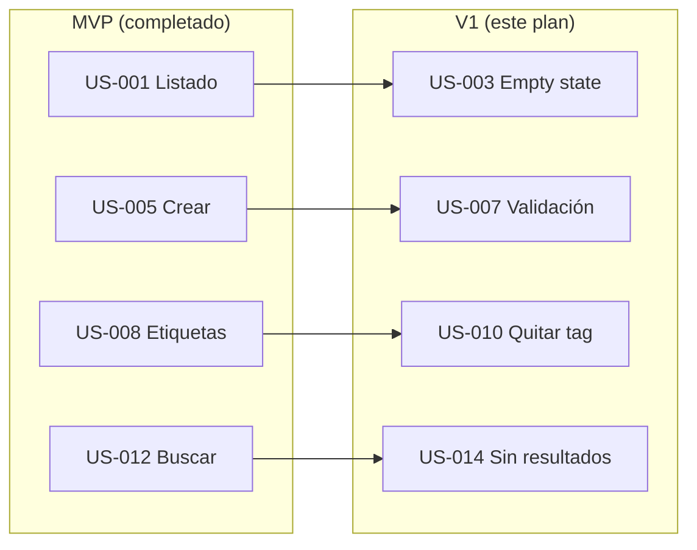

# 📋 Plan de implementación — Organizador de Conocimiento

**Versión:** 1.0  
**Alcance:** V1 — Pulido de experiencia  
**Fuente:** LLD-v1 §12, roadmap-v1, user stories V1, PRD-v1, HLD-v1  
**Autor:** Implementation Planner Agent  
**Última actualización:** 6 de julio de 2026

---

## 0. Resumen ejecutivo

Plan de implementación del **release V1** en **4 fases verticales**, con **16 tasks** ordenadas en cola global. El MVP está completado (40/40 tasks `done` en `implementation-queue-mvp.json`). V1 añade pulido UX sin ampliar el núcleo funcional: estados vacíos, validación de formularios, desasociación de etiquetas y feedback de búsqueda.

| Métrica | Valor |
|---------|-------|
| Prerrequisito | MVP completado (US-001…US-016 en scope MVP) |
| Historias en alcance | 4 (US-003, US-007, US-010, US-014) |
| Tasks en cola | 16 |
| Fases de entrega | 4 |
| Duración estimada | 1–2 sprints (equipo académico) |

**Cola ejecutable:** [`implementation-queue-v1.json`](implementation-queue-v1.json)

**Change OpenSpec activo:** [`us-003-empty-state`](../../openspec/changes/us-003-empty-state/) — PHASE-001 ✅ completada (2026-07-06).  
**Siguiente ítem en cola:** `sequence: 5` → **TASK-025** (validación API, US-007).

---

## 1. Objetivo de negocio (V1)

Mejorar la experiencia de uso sobre el ciclo CRUD ya entregado en MVP, reduciendo fricción en primer uso, validación de formularios, gestión fina de etiquetas y feedback de búsqueda (roadmap §Release V1).

| Objetivo | Historias |
|----------|-----------|
| Orientar al usuario sin notas (empty state + CTA) | US-003 |
| Validación clara sin pérdida de datos escritos | US-007 |
| Reorganizar etiquetas sin borrar notas | US-010 |
| Feedback explícito cuando la búsqueda no devuelve resultados | US-014 |

**Trazabilidad LLD-v1 §12:**

| Capacidad V1 | Historia | Endpoint / componente |
|--------------|----------|------------------------|
| Empty state orientativo | US-003 | `EmptyState` en `NoteList` |
| Validación inline FE | US-007 | `error.details[]` + validación cliente |
| Quitar etiqueta de nota | US-010 | `DELETE /notas/:id/etiquetas/:tagId` |
| Mensaje búsqueda vacía | US-014 | `SearchEmptyState` + metadata `searchTerm` |

---

## 2. Dependencias entre historias

Todas las historias V1 **relacionan** con historias MVP ya implementadas. No hay dependencias entre historias V1 entre sí; el orden de fases prioriza valor de entrada (listado) → captura → etiquetas → búsqueda.



| Historia V1 | Depende de (MVP) | Tipo | Motivo |
|-------------|------------------|------|--------|
| US-003 | US-001 | Relates | Mejora el listado vacío existente |
| US-007 | US-005 | Relates | Refina validación del formulario de creación/edición |
| US-010 | US-008 | Relates | Extiende asignación de etiquetas con desasociación |
| US-014 | US-012 | Relates | Mensaje de sin resultados en flujo de búsqueda |

---

## 3. Fases de implementación

### PHASE-001 — Estado vacío del listado (US-003)

**Objetivo:** Mensaje orientativo y CTA "Crear nota" cuando no hay notas.  
**Criterio de cierre:** E2E TASK-012 verde; Gherkin US-003 cumplido.

| Orden global | ID | Capa | Agente | Depende de |
|--------------|-----|------|--------|------------|
| 1 | TASK-009 | backend | backend-engineer | — |
| 2 | TASK-011 | database | backend-engineer | TASK-009 |
| 3 | TASK-010 | frontend | frontend-engineer | TASK-009 |
| 4 | TASK-012 | qa | qa-engineer | TASK-010 |

---

### PHASE-002 — Validación de formulario (US-007)

**Objetivo:** Errores por campo en cliente y servidor; datos del formulario preservados tras error.  
**Criterio de cierre:** E2E TASK-028 verde; mensaje "El título es obligatorio" visible (Gherkin).

| Orden global | ID | Capa | Agente | Depende de |
|--------------|-----|------|--------|------------|
| 5 | TASK-025 | backend | backend-engineer | TASK-012 |
| 6 | TASK-027 | database | backend-engineer | TASK-025 |
| 7 | TASK-026 | frontend | frontend-engineer | TASK-025 |
| 8 | TASK-028 | qa | qa-engineer | TASK-026 |

---

### PHASE-003 — Quitar etiqueta de nota (US-010)

**Objetivo:** Desasociar etiqueta sin borrar nota ni etiqueta global si otras notas la usan.  
**Criterio de cierre:** E2E TASK-040 verde; endpoint `DELETE` operativo (LLD §12).

| Orden global | ID | Capa | Agente | Depende de |
|--------------|-----|------|--------|------------|
| 9 | TASK-039 | database | backend-engineer | TASK-028 |
| 10 | TASK-037 | backend | backend-engineer | TASK-039 |
| 11 | TASK-038 | frontend | frontend-engineer | TASK-037 |
| 12 | TASK-040 | qa | qa-engineer | TASK-038 |

---

### PHASE-004 — Búsqueda sin resultados (US-014)

**Objetivo:** Mensaje contextual "Sin resultados para [término]" con campo de búsqueda editable.  
**Criterio de cierre:** E2E TASK-056 verde; texto Gherkin exacto.

| Orden global | ID | Capa | Agente | Depende de |
|--------------|-----|------|--------|------------|
| 13 | TASK-055 | database | backend-engineer | TASK-040 |
| 14 | TASK-053 | backend | backend-engineer | TASK-055 |
| 15 | TASK-054 | frontend | frontend-engineer | TASK-053 |
| 16 | TASK-056 | qa | qa-engineer | TASK-054 |

---

## 4. Cola priorizada global (completa)

| # | ID | Historia | Capa | Agente | Estado |
|---|-----|----------|------|--------|--------|
| 1 | TASK-009 | US-003 | backend | backend-engineer | backlog |
| 2 | TASK-011 | US-003 | database | backend-engineer | backlog |
| 3 | TASK-010 | US-003 | frontend | frontend-engineer | backlog |
| 4 | TASK-012 | US-003 | qa | qa-engineer | backlog |
| 5 | TASK-025 | US-007 | backend | backend-engineer | backlog |
| 6 | TASK-027 | US-007 | database | backend-engineer | backlog |
| 7 | TASK-026 | US-007 | frontend | frontend-engineer | backlog |
| 8 | TASK-028 | US-007 | qa | qa-engineer | backlog |
| 9 | TASK-039 | US-010 | database | backend-engineer | backlog |
| 10 | TASK-037 | US-010 | backend | backend-engineer | backlog |
| 11 | TASK-038 | US-010 | frontend | frontend-engineer | backlog |
| 12 | TASK-040 | US-010 | qa | qa-engineer | backlog |
| 13 | TASK-055 | US-014 | database | backend-engineer | backlog |
| 14 | TASK-053 | US-014 | backend | backend-engineer | backlog |
| 15 | TASK-054 | US-014 | frontend | frontend-engineer | backlog |
| 16 | TASK-056 | US-014 | qa | qa-engineer | backlog |

> Cola completa: [`implementation-queue-v1.json`](implementation-queue-v1.json) → `queue[]`.

---

## 5. Reglas de priorización aplicadas

| Regla | Descripción |
|-------|-------------|
| R1 | MVP completado antes de iniciar V1 (prerrequisito verificado en `status-v1.json`) |
| R2 | Dentro de cada slice: **DB → BE → FE → QA** |
| R3 | `depends_on` solo referencia tasks con `sequence` menor |
| R4 | Fases ordenadas por épica del viaje de usuario: navegar → capturar → organizar → recuperar |
| R5 | Tasks de verificación DB sin migración van tras BE del mismo slice cuando validan contrato API |

---

## 6. Invocación de agentes desarrollador

Para implementar el ítem **N** de la cola V1:

1. Leer `implementation-queue-v1.json` → `queue[N-1]` (primer `status: backlog`)
2. Cargar user story: `02-docs/02_1-product/user-stories/{story_id}.md`
3. Crear o abrir change OpenSpec: `/opsx:propose us-NNN-<slug>`
4. Invocar agente indicado en `agent`
5. Al completar: actualizar `status` en `implementation-queue-v1.json` y `status-v1.json`

**Consultar siguiente task:**

```bash
jq '.queue[] | select(.status == "backlog") | {sequence, id, story_id, layer, agent}' 02-docs/02_3-engineering/implementation-queue-v1.json | head -1
```

**Prompt sugerido:**

```
Implementa TASK-009 según 02-docs/02_3-engineering/implementation-queue-v1.json
y 02-docs/02_1-product/user-stories/US-003.md.
Actualiza status a done en implementation-queue-v1.json y status-v1.json.
```

**Sincronización al completar cada task:**

1. Marcar `"status": "done"` en `implementation-queue-v1.json` → entrada con `sequence` correspondiente
2. Marcar task en `status-v1.json` → `stories.US-NNN.tasks.TASK-XXX`
3. Checkbox en `openspec/changes/*/tasks.md` del change activo

---

## 7. Riesgos y mitigaciones

| Riesgo | Impacto | Mitigación |
|--------|---------|------------|
| Historias sin enriquecer | Plan/cola bloqueados por gate | Ejecutar `npm run check:stories-enriched:v1` antes del planner |
| Duplicar validación FE/BE | Inconsistencia de mensajes | Zod backend como fuente de verdad; FE consume `error.details[]` (LLD §13) |
| DELETE etiqueta borra entidad por error | Pérdida de datos | TASK-039 verifica FK sin cascade a notas/etiquetas; tests Gherkin US-010 |
| Confundir cola MVP con V1 | Agentes implementan task equivocada | Usar `implementation-queue-v1.json` exclusivamente para V1 |

---

## 8. Fuera de alcance (este plan)

- Historias **V2+**: US-004 (ordenación listado), US-011 (catálogo etiquetas), US-017 (backlinks)
- Historias **MVP** ya completadas (no re-encolar en cola V1)
- Autenticación multi-usuario, grafo, plugins (PRD §8)
- OpenAPI (`api-spec-v1.yaml`) — opcional post-V1

---

*Generado con el agente Implementation Planner a partir de `roadmap-v1.md`, `LLD-v1.md` §12, user stories V1 y `01-knowledge/templates/engineering/implementation-plan-template.md`.*
