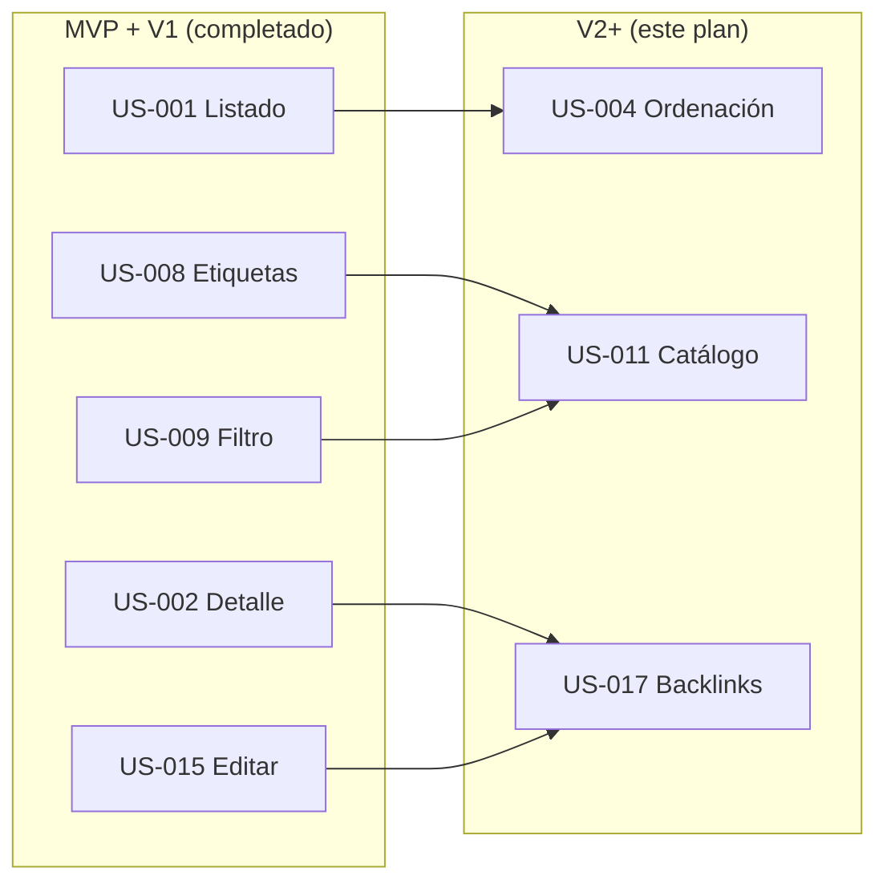

# 📋 Plan de implementación — Organizador de Conocimiento

**Versión:** 1.0  
**Alcance:** V2+ — Evolución del producto  
**Fuente:** LLD-v1 §12, roadmap-v1, user stories V2+, PRD-v1 §8, HLD-v1  
**Autor:** Implementation Planner Agent  
**Última actualización:** 6 de julio de 2026

---

## 0. Resumen ejecutivo

Plan de implementación del **release V2+** en **3 fases verticales**, con **12 tasks** ordenadas en cola global. MVP y V1 están completados. V2+ añade capacidades avanzadas: ordenación del listado, catálogo de etiquetas con conteo y backlinks entre notas.

| Métrica | Valor |
|---------|-------|
| Prerrequisito | V1 completado (16/16 tasks `done` en `implementation-queue-v1.json`) |
| Historias en alcance | 3 (US-004, US-011, US-017) |
| Tasks en cola | 12 |
| Fases de entrega | 3 |
| Duración estimada | 2–3 sprints (equipo académico) |

**Cola ejecutable:** [`implementation-queue-v2.json`](implementation-queue-v2.json)

**Change OpenSpec activo:** [`us-004-list-sort`](../../openspec/changes/us-004-list-sort/) — PHASE-001 ✅ completada (2026-07-06).  
**Siguiente ítem en cola:** `sequence: 5` → **TASK-043** (query COUNT etiquetas, US-011).

---

## 1. Objetivo de negocio (V2+)

Evolucionar el producto con capacidades planificadas en el PRD §8 y el roadmap, sin scope creep hacia grafo visual, plugins o multi-usuario.

| Objetivo | Historia |
|----------|----------|
| Priorizar revisión de la biblioteca (orden fecha/título) | US-004 |
| Visión global de distribución temática (etiquetas + conteo) | US-011 |
| Navegar relaciones entre ideas (backlinks bidireccionales) | US-017 |

**Trazabilidad LLD-v1 §12:**

| Capacidad V2+ | Historia | Endpoint / componente |
|---------------|----------|------------------------|
| Ordenación listado | US-004 | `GET /notas?sort=&order=` + `NoteSortSelect` |
| Catálogo etiquetas | US-011 | `GET /etiquetas` → `{ id, name, count }` + `TagCatalog` |
| Backlinks | US-017 | Tabla `nota_backlink`; `POST/GET .../backlinks` + `BacklinksPanel` |

---

## 2. Dependencias entre historias

Las historias V2+ dependen de MVP/V1 ya implementados. Entre sí no hay dependencia directa; el orden de fases prioriza complejidad creciente (listado → etiquetas → backlinks).



| Historia V2+ | Depende de | Tipo | Motivo |
|--------------|------------|------|--------|
| US-004 | US-001 | Relates | Extiende ordenación sobre listado base |
| US-011 | US-008, US-009 | Relates | Catálogo con conteo; clic reutiliza filtro |
| US-017 | US-002, US-015 | Blocks | Backlinks requieren detalle y edición |

---

## 3. Fases de implementación

### PHASE-001 — Ordenación del listado (US-004)

**Objetivo:** Selector de orden por fecha o título; persistencia en sesión del navegador.  
**Criterio de cierre:** E2E TASK-016 verde; Gherkin US-004 cumplido.  
**OpenSpec sugerido:** `us-004-list-sort`

| Orden global | ID | Capa | Agente | Depende de |
|--------------|-----|------|--------|------------|
| 1 | TASK-015 | database | backend-engineer | — |
| 2 | TASK-013 | backend | backend-engineer | TASK-015 |
| 3 | TASK-014 | frontend | frontend-engineer | TASK-013 |
| 4 | TASK-016 | qa | qa-engineer | TASK-014 |

**Nota:** `sort`/`order` ya existen parcialmente en BE (MVP); TASK-013 cierra tests y contrato; TASK-015 verifica `idx_notas_title` sin migración nueva.

---

### PHASE-002 — Catálogo de etiquetas (US-011)

**Objetivo:** Panel sidebar con «nombre (N)»; clic activa filtro US-009.  
**Criterio de cierre:** E2E TASK-044 verde; breaking change controlado en `GET /etiquetas`.  
**OpenSpec sugerido:** `us-011-tag-catalog`

| Orden global | ID | Capa | Agente | Depende de |
|--------------|-----|------|--------|------------|
| 5 | TASK-043 | database | backend-engineer | TASK-016 |
| 6 | TASK-041 | backend | backend-engineer | TASK-043 |
| 7 | TASK-042 | frontend | frontend-engineer | TASK-041 |
| 8 | TASK-044 | qa | qa-engineer | TASK-042 |

---

### PHASE-003 — Backlinks entre notas (US-017)

**Objetivo:** Crear enlace saliente en edición; ver entrantes en detalle destino.  
**Criterio de cierre:** E2E TASK-068 verde; migración `nota_backlink` aplicada.  
**OpenSpec sugerido:** `us-017-backlinks`

| Orden global | ID | Capa | Agente | Depende de |
|--------------|-----|------|--------|------------|
| 9 | TASK-067 | database | backend-engineer | TASK-044 |
| 10 | TASK-065 | backend | backend-engineer | TASK-067 |
| 11 | TASK-066 | frontend | frontend-engineer | TASK-065 |
| 12 | TASK-068 | qa | qa-engineer | TASK-066 |

**Gap LLD:** API backlinks documentada como propuesta en `US-017.md` (alineada HLD §12.2); confirmar en design OpenSpec.

---

## 4. Cola priorizada global (completa)

| # | ID | Historia | Capa | Agente | Estado |
|---|-----|----------|------|--------|--------|
| 1 | TASK-015 | US-004 | database | backend-engineer | backlog |
| 2 | TASK-013 | US-004 | backend | backend-engineer | backlog |
| 3 | TASK-014 | US-004 | frontend | frontend-engineer | backlog |
| 4 | TASK-016 | US-004 | qa | qa-engineer | backlog |
| 5 | TASK-043 | US-011 | database | backend-engineer | backlog |
| 6 | TASK-041 | US-011 | backend | backend-engineer | backlog |
| 7 | TASK-042 | US-011 | frontend | frontend-engineer | backlog |
| 8 | TASK-044 | US-011 | qa | qa-engineer | backlog |
| 9 | TASK-067 | US-017 | database | backend-engineer | backlog |
| 10 | TASK-065 | US-017 | backend | backend-engineer | backlog |
| 11 | TASK-066 | US-017 | frontend | frontend-engineer | backlog |
| 12 | TASK-068 | US-017 | qa | qa-engineer | backlog |

> Cola completa: [`implementation-queue-v2.json`](implementation-queue-v2.json) → `queue[]`.

---

## 5. Reglas de priorización aplicadas

| Regla | Descripción |
|-------|-------------|
| R1 | V1 completado antes de iniciar V2+ (prerrequisito en cola V1) |
| R2 | Dentro de cada slice: **DB → BE → FE → QA** |
| R3 | `depends_on` solo referencia tasks con `sequence` menor |
| R4 | Fases por complejidad: ordenación → catálogo → backlinks |
| R5 | US-017 siempre tras migración `nota_backlink` (TASK-067 antes de TASK-065) |

---

## 6. Invocación de agentes desarrollador

Para implementar el ítem **N** de la cola V2+:

1. Leer `implementation-queue-v2.json` → primer `status: backlog`
2. Cargar user story: `02-docs/02_1-product/user-stories/{story_id}.md`
3. Crear o abrir change OpenSpec: `/opsx:propose us-004-list-sort` (o slug de la fase)
4. Invocar agente indicado en `agent`
5. Al completar: actualizar `status` en `implementation-queue-v2.json` y `status-v1.json`

**Consultar siguiente task:**

```bash
jq '.queue[] | select(.status == "backlog") | {sequence, id, story_id, layer, agent}' 02-docs/02_3-engineering/implementation-queue-v2.json | head -1
```

**Prompt sugerido:**

```
Implementa TASK-015 según 02-docs/02_3-engineering/implementation-queue-v2.json
y 02-docs/02_1-product/user-stories/US-004.md.
Actualiza status a done en implementation-queue-v2.json y status-v1.json.
```

**Sincronización al completar cada task:**

1. Marcar `"status": "done"` en `implementation-queue-v2.json`
2. Marcar task en `status-v1.json` → `stories.US-NNN.tasks.TASK-XXX`
3. Checkbox en `openspec/changes/*/tasks.md` del change activo

---

## 7. Riesgos y mitigaciones

| Riesgo | Impacto | Mitigación |
|--------|---------|------------|
| API `GET /etiquetas` cambia shape | Rompe FE/tests MVP | TASK-041 + actualizar `notesApi.ts` y tests en mismo slice |
| Backlinks sin spec LLD detallada | Implementación divergente | Design OpenSpec con propuesta de `US-017.md` |
| Self-link o duplicados | Datos inconsistentes | Validación en `backlink.service` + tests 400 |
| Confundir cola V1 con V2+ | Task equivocada | Usar exclusivamente `implementation-queue-v2.json` |

---

## 8. Fuera de alcance (este plan)

- Grafo de conocimiento visual (PRD §8)
- Sistema de plugins
- Autenticación multi-usuario
- Eliminar backlinks / sintaxis `[[nota]]` en contenido
- Historias MVP/V1 ya completadas

---

*Generado con el agente Implementation Planner a partir de `roadmap-v1.md`, `LLD-v1.md` §12, user stories V2+ enriquecidas y `01-knowledge/templates/engineering/implementation-plan-template.md`.*
