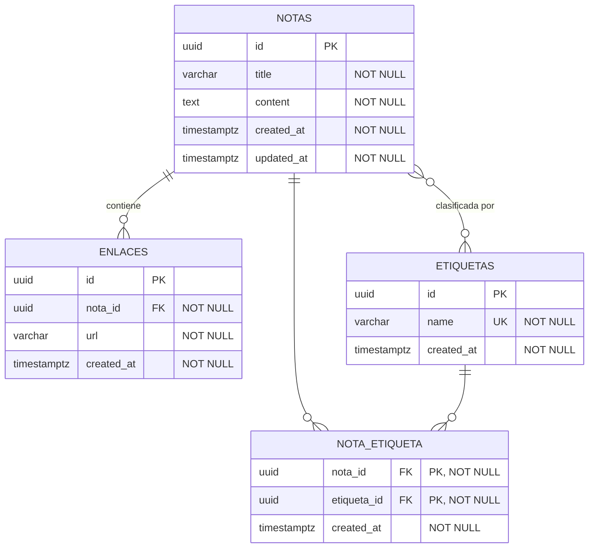
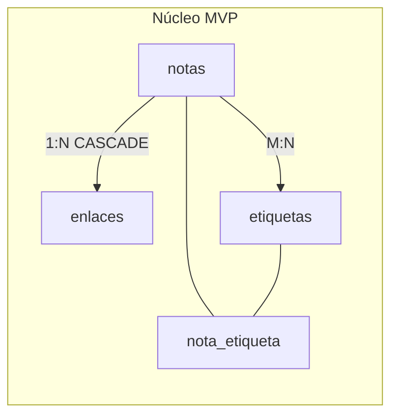

# 🗄 Data Model — Organizador de Conocimiento (Notion Simplificado)

**Versión:** 1.0  
**Fuente:** `architecture/architecture_v1.md`, `knowledge/product/prd_v1.md`  
**Motor de BD:** PostgreSQL 16  
**ORM:** Prisma 5  
**Última actualización:** 12 de junio de 2026

---

## 0. Resumen del modelo

Modelo relacional normalizado para el MVP del Organizador de Conocimiento: cuatro tablas (`notas`, `enlaces`, `etiquetas`, `nota_etiqueta`) que soportan CRUD de notas, URLs asociadas, etiquetado many-to-many y consultas de listado, filtrado y búsqueda. UUID como clave primaria en todas las entidades; timestamps automáticos en notas; cascada al eliminar notas para enlaces y asociaciones.

| Métrica | Valor |
|---------|-------|
| Entidades MVP | 3 (+ 1 tabla puente) |
| Tablas MVP | 4 |
| Relaciones | 3 (1:N, M:N, N:1) |
| Índices | 7 |

**Convenciones de nomenclatura:**

- Tablas: `snake_case` en plural (`notas`, `etiquetas`)
- Columnas: `snake_case` (`created_at`, `nota_id`)
- PK: `id` UUID v4 (`gen_random_uuid()`)
- FK: `{entidad_singular}_id`
- Timestamps: `created_at`, `updated_at` (TIMESTAMPTZ UTC)

---

## 1. Diagrama del modelo de datos (Mermaid ER)



---

## 2. Diagrama lógico (relaciones)



---

## 3. Catálogo de entidades

### 3.1 Nota (`notas`)

**Descripción:** Unidad principal de información personal. Almacena título y contenido textual con metadatos temporales.  
**Ámbito:** MVP  
**Trazabilidad PRD:** RF-001, RF-003, RF-004, RF-005, RF-006, RF-015, RF-016

| Atributo | Tipo SQL | Null | Default | Restricciones | Descripción |
|----------|----------|------|---------|---------------|-------------|
| `id` | UUID | NO | `gen_random_uuid()` | PK | Identificador único de la nota |
| `title` | VARCHAR(500) | NO | — | CHECK `length(trim(title)) > 0` | Título visible en listados y búsqueda |
| `content` | TEXT | NO | — | CHECK `length(trim(content)) > 0` | Cuerpo textual de la nota |
| `created_at` | TIMESTAMPTZ | NO | `now()` | — | Momento de creación (inmutable en MVP) |
| `updated_at` | TIMESTAMPTZ | NO | `now()` | — | Última modificación; actualizado en cada UPDATE |

**Relaciones:**

| Relación | Entidad destino | Tipo | FK | ON DELETE |
|----------|-----------------|------|-----|-----------|
| enlaces | `enlaces` | 1:N | `enlaces.nota_id` | CASCADE |
| etiquetas | `etiquetas` | M:N vía `nota_etiqueta` | `nota_etiqueta.nota_id` | CASCADE |

**Índices:**

| Nombre | Columnas | Tipo | Propósito |
|--------|----------|------|-----------|
| `idx_notas_created_at` | `created_at DESC` | B-tree | Listado por fecha (RF-015, RNF-001) |
| `idx_notas_updated_at` | `updated_at DESC` | B-tree | Ordenación búsqueda por fecha (RF-014) |
| `idx_notas_title` | `title` | B-tree | Búsqueda ILIKE en título (RF-012, RNF-002) |

---

### 3.2 Enlace (`enlaces`)

**Descripción:** URL de referencia externa asociada a una nota. Una nota puede tener cero o más enlaces.  
**Ámbito:** MVP  
**Trazabilidad PRD:** RF-002, RNF-008

| Atributo | Tipo SQL | Null | Default | Restricciones | Descripción |
|----------|----------|------|---------|---------------|-------------|
| `id` | UUID | NO | `gen_random_uuid()` | PK | Identificador del enlace |
| `nota_id` | UUID | NO | — | FK → `notas.id` | Nota propietaria |
| `url` | VARCHAR(2048) | NO | — | CHECK formato URL (app) | URL del recurso externo |
| `created_at` | TIMESTAMPTZ | NO | `now()` | — | Fecha de asociación |

**Relaciones:**

| Relación | Entidad destino | Tipo | FK | ON DELETE |
|----------|-----------------|------|-----|-----------|
| nota | `notas` | N:1 | `nota_id` | CASCADE |

**Índices:**

| Nombre | Columnas | Tipo | Propósito |
|--------|----------|------|-----------|
| `idx_enlaces_nota_id` | `nota_id` | B-tree | Carga de enlaces en detalle de nota |

---

### 3.3 Etiqueta (`etiquetas`)

**Descripción:** Elemento de categorización temática. Nombre único en el ámbito single-user del MVP.  
**Ámbito:** MVP  
**Trazabilidad PRD:** RF-007, RF-008, RF-009, RF-011, RF-017

| Atributo | Tipo SQL | Null | Default | Restricciones | Descripción |
|----------|----------|------|---------|---------------|-------------|
| `id` | UUID | NO | `gen_random_uuid()` | PK | Identificador de la etiqueta |
| `name` | VARCHAR(100) | NO | — | UNIQUE | Nombre normalizado (trim; case según regla de negocio) |
| `created_at` | TIMESTAMPTZ | NO | `now()` | — | Fecha de primera creación |

**Relaciones:**

| Relación | Entidad destino | Tipo | FK | ON DELETE |
|----------|-----------------|------|-----|-----------|
| notas | `notas` | M:N vía `nota_etiqueta` | `nota_etiqueta.etiqueta_id` | RESTRICT en etiqueta si se implementa DELETE de etiqueta |

**Índices:**

| Nombre | Columnas | Tipo | Propósito |
|--------|----------|------|-----------|
| `idx_etiquetas_name` | `name` | B-tree UNIQUE | Unicidad y búsqueda por nombre (RF-009) |

---

### 3.4 Nota–Etiqueta (`nota_etiqueta`)

**Descripción:** Tabla puente para relación many-to-many entre notas y etiquetas.  
**Ámbito:** MVP  
**Trazabilidad PRD:** RF-008, RF-010, RF-011

| Atributo | Tipo SQL | Null | Default | Restricciones | Descripción |
|----------|----------|------|---------|---------------|-------------|
| `nota_id` | UUID | NO | — | PK (compuesta), FK → `notas.id` | Referencia a nota |
| `etiqueta_id` | UUID | NO | — | PK (compuesta), FK → `etiquetas.id` | Referencia a etiqueta |
| `created_at` | TIMESTAMPTZ | NO | `now()` | — | Fecha de asociación |

**Relaciones:**

| Relación | Entidad destino | Tipo | FK | ON DELETE |
|----------|-----------------|------|-----|-----------|
| nota | `notas` | N:1 | `nota_id` | CASCADE |
| etiqueta | `etiquetas` | N:1 | `etiqueta_id` | CASCADE |

**Índices:**

| Nombre | Columnas | Tipo | Propósito |
|--------|----------|------|-----------|
| `idx_nota_etiqueta_etiqueta` | `etiqueta_id, nota_id` | B-tree | Filtro por etiqueta (RF-011, RF-017) |
| `idx_nota_etiqueta_nota` | `nota_id` | B-tree | Carga de etiquetas en detalle |

---

## 4. Tabla de relaciones consolidada

| Origen | Destino | Cardinalidad | Tabla / FK | Regla de integridad |
|--------|---------|--------------|------------|---------------------|
| `notas` | `enlaces` | 1:N | `enlaces.nota_id` | ON DELETE CASCADE |
| `notas` | `etiquetas` | M:N | `nota_etiqueta` | PK compuesta; CASCADE en ambos FK al borrar nota o etiqueta |
| `enlaces` | `notas` | N:1 | `enlaces.nota_id` | NOT NULL; nota debe existir |
| `nota_etiqueta` | `notas` | N:1 | `nota_etiqueta.nota_id` | ON DELETE CASCADE |
| `nota_etiqueta` | `etiquetas` | N:1 | `nota_etiqueta.etiqueta_id` | ON DELETE CASCADE |

---

## 5. Restricciones de negocio (nivel datos)

| ID | Regla | Implementación | Fuente |
|----|-------|----------------|--------|
| BR-001 | Título y contenido obligatorios | CHECK + validación Zod en API | RF-001, RNF-008 |
| BR-002 | Nombre de etiqueta único por usuario | UNIQUE en `etiquetas.name` | RF-009 |
| BR-003 | Una nota no puede tener la misma etiqueta dos veces | PK compuesta `(nota_id, etiqueta_id)` | RF-008 |
| BR-004 | Al eliminar nota, se eliminan enlaces y asociaciones | ON DELETE CASCADE | RF-006 |
| BR-005 | URL con formato válido | Validación en servicio (Zod); VARCHAR(2048) en BD | RF-002, RNF-008 |
| BR-006 | `updated_at` se refresca en cada UPDATE | Trigger o lógica Prisma `@updatedAt` | RF-005 |

---

## 6. Esquema ORM (Prisma)

```prisma
// backend/prisma/schema.prisma

generator client {
  provider = "prisma-client-js"
}

datasource db {
  provider = "postgresql"
  url      = env("DATABASE_URL")
}

model Nota {
  id        String   @id @default(uuid()) @db.Uuid
  title     String   @db.VarChar(500)
  content   String   @db.Text
  createdAt DateTime @default(now()) @map("created_at") @db.Timestamptz
  updatedAt DateTime @updatedAt @map("updated_at") @db.Timestamptz

  enlaces   Enlace[]
  etiquetas NotaEtiqueta[]

  @@index([createdAt(sort: Desc)], map: "idx_notas_created_at")
  @@index([updatedAt(sort: Desc)], map: "idx_notas_updated_at")
  @@index([title], map: "idx_notas_title")
  @@map("notas")
}

model Enlace {
  id        String   @id @default(uuid()) @db.Uuid
  notaId    String   @map("nota_id") @db.Uuid
  url       String   @db.VarChar(2048)
  createdAt DateTime @default(now()) @map("created_at") @db.Timestamptz

  nota Nota @relation(fields: [notaId], references: [id], onDelete: Cascade)

  @@index([notaId], map: "idx_enlaces_nota_id")
  @@map("enlaces")
}

model Etiqueta {
  id        String   @id @default(uuid()) @db.Uuid
  name      String   @unique @db.VarChar(100)
  createdAt DateTime @default(now()) @map("created_at") @db.Timestamptz

  notas NotaEtiqueta[]

  @@index([name], map: "idx_etiquetas_name")
  @@map("etiquetas")
}

model NotaEtiqueta {
  notaId      String   @map("nota_id") @db.Uuid
  etiquetaId  String   @map("etiqueta_id") @db.Uuid
  createdAt   DateTime @default(now()) @map("created_at") @db.Timestamptz

  nota     Nota     @relation(fields: [notaId], references: [id], onDelete: Cascade)
  etiqueta Etiqueta @relation(fields: [etiquetaId], references: [id], onDelete: Cascade)

  @@id([notaId, etiquetaId])
  @@index([etiquetaId, notaId], map: "idx_nota_etiqueta_etiqueta")
  @@index([notaId], map: "idx_nota_etiqueta_nota")
  @@map("nota_etiqueta")
}
```

---

## 7. DDL de referencia (SQL)

```sql
-- Migración inicial MVP — Organizador de Conocimiento

CREATE EXTENSION IF NOT EXISTS "pgcrypto";

CREATE TABLE notas (
    id          UUID PRIMARY KEY DEFAULT gen_random_uuid(),
    title       VARCHAR(500) NOT NULL,
    content     TEXT NOT NULL,
    created_at  TIMESTAMPTZ NOT NULL DEFAULT now(),
    updated_at  TIMESTAMPTZ NOT NULL DEFAULT now(),
    CONSTRAINT chk_notas_title_not_empty CHECK (length(trim(title)) > 0),
    CONSTRAINT chk_notas_content_not_empty CHECK (length(trim(content)) > 0)
);

CREATE TABLE enlaces (
    id          UUID PRIMARY KEY DEFAULT gen_random_uuid(),
    nota_id     UUID NOT NULL REFERENCES notas(id) ON DELETE CASCADE,
    url         VARCHAR(2048) NOT NULL,
    created_at  TIMESTAMPTZ NOT NULL DEFAULT now()
);

CREATE TABLE etiquetas (
    id          UUID PRIMARY KEY DEFAULT gen_random_uuid(),
    name        VARCHAR(100) NOT NULL UNIQUE,
    created_at  TIMESTAMPTZ NOT NULL DEFAULT now()
);

CREATE TABLE nota_etiqueta (
    nota_id     UUID NOT NULL REFERENCES notas(id) ON DELETE CASCADE,
    etiqueta_id UUID NOT NULL REFERENCES etiquetas(id) ON DELETE CASCADE,
    created_at  TIMESTAMPTZ NOT NULL DEFAULT now(),
    PRIMARY KEY (nota_id, etiqueta_id)
);

-- Índices
CREATE INDEX idx_notas_created_at ON notas (created_at DESC);
CREATE INDEX idx_notas_updated_at ON notas (updated_at DESC);
CREATE INDEX idx_notas_title ON notas (title);
CREATE INDEX idx_enlaces_nota_id ON enlaces (nota_id);
CREATE INDEX idx_etiquetas_name ON etiquetas (name);
CREATE INDEX idx_nota_etiqueta_etiqueta ON nota_etiqueta (etiqueta_id, nota_id);
CREATE INDEX idx_nota_etiqueta_nota ON nota_etiqueta (nota_id);

-- Trigger updated_at (alternativa a Prisma @updatedAt)
CREATE OR REPLACE FUNCTION set_updated_at()
RETURNS TRIGGER AS $$
BEGIN
    NEW.updated_at = now();
    RETURN NEW;
END;
$$ LANGUAGE plpgsql;

CREATE TRIGGER trg_notas_updated_at
    BEFORE UPDATE ON notas
    FOR EACH ROW EXECUTE FUNCTION set_updated_at();
```

---

## 8. Mapeo entidad → API DTO

| Entidad / Tabla | Campo BD | Campo API (JSON) | Transformación |
|-----------------|----------|------------------|----------------|
| `notas` | `id` | `id` | UUID string |
| `notas` | `title` | `title` | — |
| `notas` | `content` | `content` | — |
| `notas` | `created_at` | `createdAt` | snake_case → camelCase |
| `notas` | `updated_at` | `updatedAt` | snake_case → camelCase |
| `enlaces` | `url` | `links[]` | Agregación en DTO de nota |
| `etiquetas` | `name` | `tags[]` | Agregación de nombres en DTO de nota |
| `notas` (resumen) | `title`, `created_at` | `title`, `createdAt` | NotaResumen en listados |

---

## 9. Consultas críticas

### 9.1 Listar todas las notas (orden por fecha)

**Caso de uso:** RF-015, US-001  
**RNF / SLA:** RNF-001 — < 2 s

```sql
SELECT id, title, created_at, updated_at
FROM notas
ORDER BY created_at DESC;
```

### 9.2 Detalle de nota con enlaces y etiquetas

**Caso de uso:** RF-004, RF-016, US-002  
**RNF / SLA:** RNF-001

```sql
SELECT
    n.id,
    n.title,
    n.content,
    n.created_at,
    n.updated_at,
    COALESCE(
        (SELECT json_agg(e.url ORDER BY e.created_at)
         FROM enlaces e WHERE e.nota_id = n.id),
        '[]'::json
    ) AS links,
    COALESCE(
        (SELECT json_agg(t.name ORDER BY t.name)
         FROM nota_etiqueta ne
         JOIN etiquetas t ON t.id = ne.etiqueta_id
         WHERE ne.nota_id = n.id),
        '[]'::json
    ) AS tags
FROM notas n
WHERE n.id = $1;
```

### 9.3 Búsqueda por término en título y contenido

**Caso de uso:** RF-012, RF-013, US-012  
**RNF / SLA:** RNF-002 — < 300 ms (500 notas)

```sql
SELECT id, title, created_at, updated_at,
       CASE
           WHEN title ILIKE '%' || $1 || '%' THEN 1
           ELSE 2
       END AS relevance
FROM notas
WHERE title ILIKE '%' || $1 || '%'
   OR content ILIKE '%' || $1 || '%'
ORDER BY relevance ASC, updated_at DESC
LIMIT 50;
```

### 9.4 Filtrar notas por etiqueta

**Caso de uso:** RF-011, RF-017, US-009  
**RNF / SLA:** RNF-001

```sql
SELECT n.id, n.title, n.created_at, n.updated_at
FROM notas n
INNER JOIN nota_etiqueta ne ON ne.nota_id = n.id
INNER JOIN etiquetas t ON t.id = ne.etiqueta_id
WHERE t.name = $1
ORDER BY n.created_at DESC;
```

---

## 10. Datos semilla (seeds)

| Tabla | Registros de ejemplo | Propósito |
|-------|----------------------|-----------|
| `notas` | 3 | Desarrollo y demos |
| `etiquetas` | 4 | Probar filtrado M:N |
| `enlaces` | 2 | Probar detalle con URLs |
| `nota_etiqueta` | 5 | Asociaciones de prueba |

```sql
-- Seed desarrollo (ejecutar tras migración)

INSERT INTO notas (id, title, content) VALUES
    ('11111111-1111-1111-1111-111111111101', 'Ideas de proyecto', 'Investigar mercado y definir alcance MVP'),
    ('11111111-1111-1111-1111-111111111102', 'Lista de la compra', 'Leche, pan, café'),
    ('11111111-1111-1111-1111-111111111103', 'Referencias técnicas', 'Stack: React, Express, PostgreSQL, Prisma');

INSERT INTO etiquetas (id, name) VALUES
    ('22222222-2222-2222-2222-222222222201', 'ideas'),
    ('22222222-2222-2222-2222-222222222202', 'personal'),
    ('22222222-2222-2222-2222-222222222203', 'trabajo'),
    ('22222222-2222-2222-2222-222222222204', 'tecnología');

INSERT INTO enlaces (nota_id, url) VALUES
    ('11111111-1111-1111-1111-111111111101', 'https://docs.example.com/mvp'),
    ('11111111-1111-1111-1111-111111111103', 'https://www.prisma.io/docs');

INSERT INTO nota_etiqueta (nota_id, etiqueta_id) VALUES
    ('11111111-1111-1111-1111-111111111101', '22222222-2222-2222-2222-222222222201'),
    ('11111111-1111-1111-1111-111111111101', '22222222-2222-2222-2222-222222222203'),
    ('11111111-1111-1111-1111-111111111102', '22222222-2222-2222-2222-222222222202'),
    ('11111111-1111-1111-1111-111111111103', '22222222-2222-2222-2222-222222222204'),
    ('11111111-1111-1111-1111-111111111103', '22222222-2222-2222-2222-222222222203');
```

---

## 11. MVP vs evolución futura

### 11.1 Entidades MVP

- `notas` — núcleo del dominio
- `enlaces` — URLs asociadas 1:N
- `etiquetas` — taxonomía
- `nota_etiqueta` — relación M:N

### 11.2 Entidades planificadas (no MVP)

| Entidad | Release | Propósito | Impacto en esquema actual |
|---------|---------|-----------|---------------------------|
| `nota_backlink` | V2+ | Relación entre notas (origen → destino) | Nueva tabla; FK a `notas.id` × 2; sin cambios en tablas MVP |
| `usuarios` | V2+ | Multi-tenancy y autenticación | Añadir `user_id` FK en `notas` y `etiquetas`; migración de datos |
| `plugin_config` | V2+ | Configuración de plugins | Tabla separada; sin acoplamiento con notas |

---

## 12. Riesgos y decisiones de modelado

| Decisión / Riesgo | Alternativa | Decisión tomada | Motivo |
|-------------------|-------------|-----------------|--------|
| Etiquetas en tabla propia vs JSON en `notas` | `tags JSONB` en nota | Tabla `etiquetas` + puente | RF-008 M:N, unicidad RF-009, filtrado RF-011 |
| UUID vs SERIAL | BIGSERIAL | UUID v4 | IDs opacos, preparado para APIs distribuidas |
| Búsqueda ILIKE vs full-text | `tsvector` GIN | ILIKE + índice btree en MVP | Suficiente < 500 notas (RNF-002); tsvector en V1 |
| Eliminar etiqueta huérfana | Soft-delete etiquetas | CASCADE en `nota_etiqueta`; etiqueta persiste si otras notas la usan | Alineado con US-010 V1 |
| Validación URL en BD | CHECK con regex URL | Validación en capa servicio (Zod) | Flexibilidad y mensajes de error claros (RNF-008) |

---

*Generado con el agente Data Model Generator a partir de `architecture/architecture_v1.md` y `knowledge/templates/technical/data_model_template.md`.*
