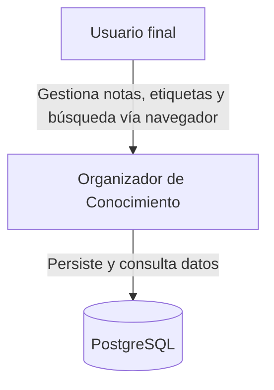
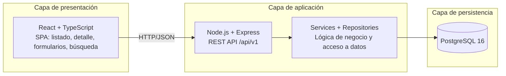
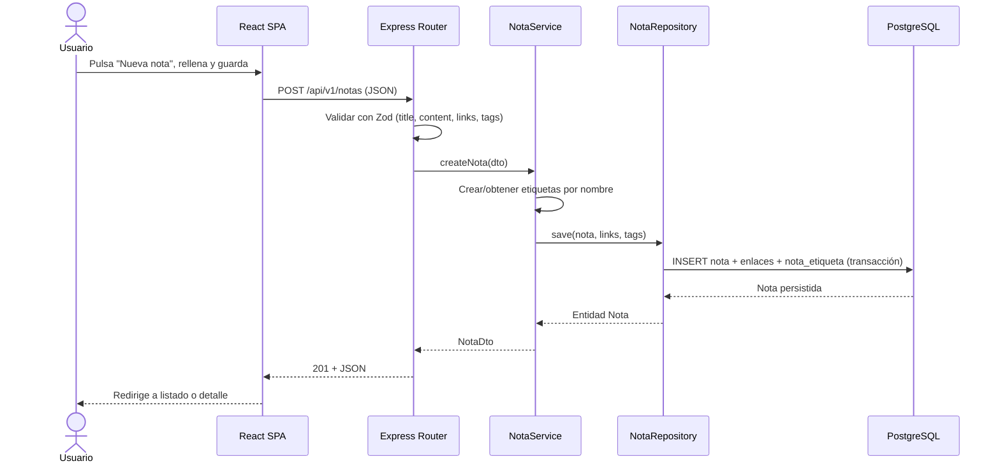
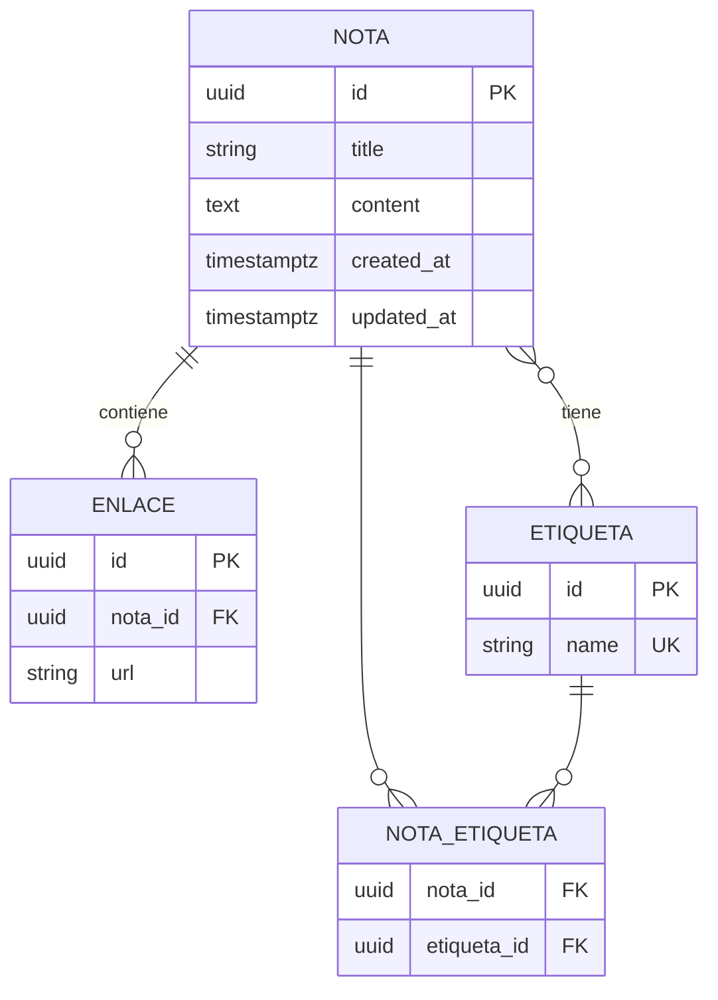
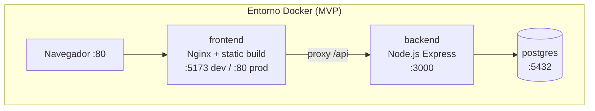

# 🏗 Architecture Overview — Organizador de Conocimiento (Notion Simplificado)

**Versión:** 1.0  
**Fuente:** `docs/product/prd/PRD-v1.md`, `docs/product/roadmap/roadmap-v1.md`  
**Autor:** Software Architect Agent  
**Última actualización:** 12 de junio de 2026

---

## 0. Resumen ejecutivo

El Organizador de Conocimiento es una aplicación web de tres capas —frontend SPA, API REST y base de datos relacional— diseñada como **monolito modular** en capas (presentación, aplicación, persistencia). El MVP cubre CRUD de notas, etiquetas many-to-many, búsqueda simple y navegación, sin autenticación multi-usuario. La arquitectura prioriza velocidad de desarrollo, separación de responsabilidades y un modelo de datos extensible para backlinks y plugins en releases futuros.

**Enfoque arquitectónico:** Monolito modular con arquitectura en capas (layered)  
**Alcance de este documento:** MVP + consideraciones de evolución futura  
**Principio rector:** Simplicidad primero; escalabilidad solo cuando esté justificada.

---

## 1. High-Level Architecture

### 1.1 Tipo de arquitectura

| Aspecto | Decisión |
|---------|----------|
| **Estilo** | Monolito modular |
| **Patrón** | Arquitectura en capas (routes → services → repositories) |
| **Despliegue MVP** | 3 contenedores Docker: frontend (Nginx) + backend + PostgreSQL |
| **Comunicación** | REST JSON sobre HTTP (`/api/v1`) |

**Justificación:** Un único backend desplegable reduce la complejidad operativa del MVP single-user. La separación en capas internas mantiene el código mantenible y preparado para extraer servicios solo si el volumen o el equipo lo exigen. El frontend desacoplado cumple RNF-005 y RNF-006 del PRD.

### 1.2 Diagrama de arquitectura (C4 — Nivel 1: Contexto)



### 1.3 Diagrama de componentes (C4 — Nivel 2: Contenedores)



---

## 2. Componentes y responsabilidades

### 2.1 Mapa de componentes

| Componente | Tecnología | Responsabilidad | Entradas | Salidas |
|------------|------------|-----------------|----------|---------|
| SPA Frontend | React 18 + Vite + TypeScript | UI: listado, detalle, CRUD, filtros, búsqueda | Eventos usuario, respuestas API | Peticiones HTTP JSON |
| REST API | Express + TypeScript | Contrato HTTP, validación, routing, errores | HTTP requests | HTTP responses JSON |
| Service Layer | TypeScript modules | Reglas de negocio: notas, etiquetas, búsqueda | DTOs validados | Entidades / DTOs |
| Repository Layer | Prisma ORM | CRUD y queries SQL | Operaciones de dominio | Modelos persistidos |
| PostgreSQL | PostgreSQL 16 | Almacenamiento relacional ACID | SQL vía Prisma | Filas / resultados |

### 2.2 Frontend

- **Tecnología:** React 18, TypeScript, Vite, React Router
- **Responsabilidad:** Renderizar la interfaz en español; orquestar llamadas a la API; gestionar estado de UI (filtros, búsqueda, formularios).
- **Principios:** Componentes presentacionales; servicios API centralizados (`api/notes.ts`); validación de cliente como primera línea de defensa (RNF-008).
- **No hace:** Acceso directo a BD; lógica de negocio de persistencia; almacenamiento autoritativo de datos.

### 2.3 Backend / API

- **Tecnología:** Node.js 20 LTS, Express 4, TypeScript, Zod (validación), Prisma
- **Responsabilidad:** Exponer API REST versionada; validar entrada; aplicar reglas de negocio; persistir y recuperar datos.
- **Capas internas:** `routes` → `controllers` → `services` → `repositories` → Prisma
- **No hace:** Renderizado HTML; estado de sesión complejo en MVP; colas/mensajería.

### 2.4 Base de datos

- **Tecnología:** PostgreSQL 16
- **Responsabilidad:** Persistencia ACID de notas, enlaces, etiquetas y relaciones many-to-many.
- **Entidades principales:** `notas`, `enlaces`, `etiquetas`, `nota_etiqueta`
- **No hace:** Lógica de aplicación; exposición directa al frontend.

### 2.5 Integraciones externas

| Integración | Propósito | MVP | Futuro |
|-------------|-----------|-----|--------|
| Ninguna obligatoria | — | Sin dependencias externas | OAuth, export Markdown, preview URLs |

---

## 3. Decisiones técnicas y trade-offs

### 3.1 Stack tecnológico

| Capa | Tecnología elegida | Alternativa descartada | Motivo de la elección |
|------|-------------------|------------------------|------------------------|
| Frontend | React + Vite + TS | Vue, Angular | Ecosistema amplio, curva suave, alineado con tasks FE del roadmap |
| Backend | Node.js + Express + TS | FastAPI (Python), NestJS | Un solo lenguaje con frontend; Express es ligero para MVP |
| Base de datos | PostgreSQL | SQLite, MongoDB | Relacional natural para M:N; índices y búsqueda ILIKE; extensible a full-text |
| ORM | Prisma | TypeORM, SQL raw | Migraciones declarativas, tipos generados, productividad |
| Testing | Vitest + Supertest + Playwright | Jest, Cypress | Vitest integrado con Vite; Playwright para E2E Gherkin |
| Contenedores | Docker Compose | Kubernetes | Suficiente para MVP local y despliegue simple |

### 3.2 Trade-offs explícitos

| Decisión | Beneficio | Coste / sacrificio | Por qué se acepta |
|----------|-----------|-------------------|-------------------|
| Monolito modular | Despliegue simple, debugging fácil | Escalado horizontal limitado al inicio | MVP single-user < 1 000 notas |
| PostgreSQL + ILIKE | Sin infra extra de búsqueda | Menos relevancia que Elasticsearch en gran escala | RNF-002 cumplible con índices hasta 500 notas |
| Sin auth en MVP | Menor complejidad y time-to-market | No apto para despliegue público multi-usuario | Documentado como limitación PRD §4 |
| API versionada `/v1` | Evolución sin romper clientes | Mantener versiones en paralelo más adelante | Preparación para plugins y multi-tenant |

### 3.3 Por qué NO otras alternativas

| Alternativa | Por qué se descarta |
|-------------|---------------------|
| Microservicios | Overhead operativo injustificado para MVP single-user con 10 historias |
| SQLite embebido | Menor paralelismo y migraciones en despliegue Docker multi-contenedor |
| MongoDB | Relaciones M:N y unicidad de etiquetas más naturales en SQL relacional |
| GraphQL | REST suficiente para CRUD y búsqueda; menor curva para el equipo académico |
| BFF separado | Capa extra innecesaria con un único cliente web |

---

## 4. Diseño de API (REST)

### 4.1 Principios

- Recursos en plural y minúsculas: `/notas`, `/etiquetas`, `/buscar`
- Prefijo versionado: `/api/v1`
- Códigos HTTP: 200 OK, 201 Created, 400 Bad Request, 404 Not Found, 500 Internal Server Error
- Errores: `{ "error": { "code": "VALIDATION_ERROR", "message": "...", "details": [...] } }`
- Paginación en listados: `?page=1&limit=20` (opcional MVP; listado completo aceptable < 1 000 notas)
- Fechas en ISO 8601 UTC

### 4.2 Endpoints MVP

| Método | Endpoint | Descripción | Request body | Response |
|--------|----------|-------------|--------------|----------|
| GET | `/api/v1/notas` | Listar notas (`?etiqueta=`, `?sort=created_at\|title`, `?order=asc\|desc`) | — | `{ "data": [NotaResumen], "meta": { "total" } }` |
| GET | `/api/v1/notas/:id` | Detalle de nota con enlaces y etiquetas | — | `{ "data": Nota }` |
| POST | `/api/v1/notas` | Crear nota | `CreateNotaDto` | `201 { "data": Nota }` |
| PUT | `/api/v1/notas/:id` | Actualizar nota (refresca `updatedAt`) | `UpdateNotaDto` | `{ "data": Nota }` |
| DELETE | `/api/v1/notas/:id` | Eliminar nota y relaciones | — | `204 No Content` |
| DELETE | `/api/v1/notas/:id/etiquetas/:tagId` | Quitar etiqueta de nota (V1) | — | `204` |
| GET | `/api/v1/etiquetas` | Listar etiquetas con conteo (V2+) | — | `{ "data": [{ "id", "name", "count" }] }` |
| GET | `/api/v1/buscar` | Búsqueda (`?q=`, `?order=relevance\|date`) | — | `{ "data": [NotaResumen], "meta": { "q", "total" } }` |

### 4.3 Contrato de ejemplo

**POST /api/v1/notas**

```json
// Request
{
  "title": "Ideas de proyecto",
  "content": "Investigar mercado y definir MVP",
  "links": ["https://docs.ejemplo.com/guia"],
  "tags": ["ideas", "urgente"]
}

// Response 201
{
  "data": {
    "id": "550e8400-e29b-41d4-a716-446655440000",
    "title": "Ideas de proyecto",
    "content": "Investigar mercado y definir MVP",
    "links": ["https://docs.ejemplo.com/guia"],
    "tags": ["ideas", "urgente"],
    "createdAt": "2026-06-12T10:00:00.000Z",
    "updatedAt": "2026-06-12T10:00:00.000Z"
  }
}
```

**Error 400 — validación**

```json
{
  "error": {
    "code": "VALIDATION_ERROR",
    "message": "Los datos enviados no son válidos",
    "details": [
      { "field": "title", "message": "El título es obligatorio" },
      { "field": "links[0]", "message": "URL con formato inválido" }
    ]
  }
}
```

---

## 5. Flujo de datos

### 5.1 Flujo crítico: Crear nota (CU-001)



### 5.2 Flujos principales

| Flujo | Ruta | Componentes involucrados | SLA (PRD) |
|-------|------|--------------------------|-----------|
| Listar notas | `GET /notas` | FE → API → NotaService → Repository | < 2 s (RNF-001) |
| Buscar | `GET /buscar?q=` | FE → API → SearchService → Repository (ILIKE + índices) | < 300 ms / 500 notas (RNF-002) |
| Filtrar por etiqueta | `GET /notas?etiqueta=` | FE → API → NotaService → JOIN nota_etiqueta | < 2 s |
| Editar nota | `PUT /notas/:id` | FE → API → NotaService → Repository (UPDATE + updated_at) | < 2 s |

### 5.3 Reglas de acoplamiento

- El frontend **solo** consume `/api/v1`; nunca accede a PostgreSQL.
- La lógica de negocio (creación automática de etiquetas, validación URL) reside en **services**.
- El acceso SQL se concentra en **repositories** vía Prisma; sin queries en routes.
- DTOs Zod validan en el límite HTTP; entidades Prisma no se exponen directamente.

---

## 6. Modelo de datos (vista arquitectónica)



| Entidad | Relaciones | Notas de diseño |
|---------|------------|-----------------|
| `notas` | 1:N `enlaces`; M:N `etiquetas` | UUID como PK; índices en `created_at`, `updated_at` |
| `enlaces` | N:1 `notas` | ON DELETE CASCADE; validación URL en capa servicio |
| `etiquetas` | M:N `notas` | UNIQUE en `name` (single-user MVP); normalización trim + lowercase opcional |
| `nota_etiqueta` | Tabla puente | PK compuesta (nota_id, etiqueta_id) |

**Índices para RNF-002:**

- `notas(created_at DESC)` — listado
- `notas(updated_at DESC)` — orden búsqueda por fecha
- `notas USING gin(to_tsvector('spanish', title \|\| ' ' \|\| content))` — opcional V1; MVP: `ILIKE` con índice btree en `title`

---

## 7. Estructura del proyecto

### 7.1 Árbol de directorios

```
AI4Devs-finalproject/
├── src/
│   ├── frontend/
│   │   ├── src/
│   │   │   ├── components/       # NoteList, NoteDetail, NoteForm, TagFilter, SearchBar
│   │   │   ├── pages/            # HomePage, NotePage
│   │   │   ├── services/         # apiClient, notesApi, searchApi
│   │   │   ├── hooks/            # useNotes, useSearch
│   │   │   ├── types/            # Nota, Etiqueta DTOs
│   │   │   └── App.tsx
│   │   ├── package.json
│   │   └── vite.config.ts
│   ├── backend/
│   │   ├── src/
│   │   │   ├── routes/           # notas.routes, buscar.routes, etiquetas.routes
│   │   │   ├── controllers/
│   │   │   ├── services/         # nota.service, etiqueta.service, search.service
│   │   │   ├── repositories/     # nota.repository, etiqueta.repository
│   │   │   ├── schemas/          # Zod DTOs
│   │   │   ├── middleware/       # errorHandler, validate
│   │   │   └── app.ts
│   │   ├── prisma/
│   │   │   ├── schema.prisma
│   │   │   └── migrations/
│   │   └── package.json
│   └── infra/
│       ├── docker-compose.yml
│       ├── Dockerfile.frontend
│       └── Dockerfile.backend
├── docs/
│   ├── product/
│   └── architecture/
├── knowledge/
├── prompts/
├── docs/
├── tests/
├── delivery/
└── README.md
```

### 7.2 Convenciones por capa

| Capa | Carpeta | Contenido |
|------|---------|-----------|
| Frontend | `src/frontend/src/components` | UI reutilizable sin lógica de persistencia |
| Frontend | `src/frontend/src/services` | Cliente HTTP y mapeo de DTOs |
| Backend | `src/backend/src/routes` | Definición de endpoints y middleware |
| Backend | `src/backend/src/services` | Reglas de negocio y orquestación |
| Backend | `src/backend/src/repositories` | Queries Prisma |
| Infra | `src/infra/` | Docker Compose, variables de entorno |

---

## 8. Requisitos no funcionales (mapeo)

| RNF (PRD) | Requisito | Cómo lo cumple la arquitectura |
|-----------|-----------|--------------------------------|
| RNF-001 | CRUD < 2 s | API stateless, queries indexadas, sin N+1 en listados; pool de conexiones Prisma |
| RNF-002 | Búsqueda < 300 ms | ILIKE con índice en `title`; límite de resultados; benchmark en QA (TASK-048) |
| RNF-003 | Crear nota ≤ 2 interacciones | SPA con botón prominente "Nueva nota" en home; formulario en ruta `/notas/nueva` |
| RNF-004 | Persistencia consistente | PostgreSQL ACID; migraciones Prisma; transacciones en create/update |
| RNF-005 | Modelo extensible | Entidades desacopladas; API `/v1`; tabla puente para M:N |
| RNF-006 | Solo vía API | Frontend sin driver de BD; único canal HTTP |
| RNF-007 | Navegadores modernos | Build Vite con targets ES2020; testing en Chrome, Firefox, Safari |
| RNF-008 | Validación entrada | Zod en backend; validación HTML5 + JS en frontend; URLs con `z.string().url()` |

---

## 9. Seguridad

| Aspecto | MVP | Futuro |
|---------|-----|--------|
| Autenticación | Sin auth (single-user por instancia) | JWT / OAuth2; `user_id` en todas las entidades |
| Autorización | N/A | RBAC por nota/usuario |
| Validación de entrada | Zod + sanitización básica de strings | Rate limiting en API |
| XSS | React escapa por defecto; `dangerouslySetInnerHTML` prohibido | CSP headers |
| HTTPS | Recomendado en producción (reverse proxy) | Obligatorio |
| CORS | `localhost` en dev; dominio frontend en prod | Orígenes explícitos en env |

---

## 10. Infraestructura y despliegue

### 10.1 Entornos

| Entorno | Propósito | Componentes |
|---------|-----------|-------------|
| Local | Desarrollo | `docker-compose up`; hot-reload FE (Vite) y BE (tsx watch) |
| Staging | Pruebas pre-release | Misma topología que prod con datos de prueba |
| Producción | Demo / entrega académica | Compose o PaaS simple (Railway, Render) |

### 10.2 Diagrama de despliegue



### 10.3 Proceso de despliegue MVP

1. `docker-compose build` — construye imágenes frontend y backend.
2. `docker-compose run backend npx prisma migrate deploy` — aplica migraciones.
3. `docker-compose up -d` — levanta frontend, backend y PostgreSQL.
4. Verificar `GET /api/v1/health` y acceso a la SPA.

---

## 11. Estrategia de testing (arquitectura)

| Tipo | Alcance | Herramientas | Qué valida |
|------|---------|--------------|------------|
| Unitarios | Services, validadores Zod | Vitest | Creación etiquetas, validación URL, scoring búsqueda |
| Integración | API + PostgreSQL (test DB) | Vitest + Supertest + Prisma test | Endpoints CRUD, filtros, búsqueda |
| E2E | Flujos Gherkin del roadmap | Playwright | US-001 a US-016 MVP |
| Rendimiento | Búsqueda 500 notas | k6 o script benchmark | RNF-002 < 300 ms |

---

## 12. MVP vs evolución futura

### 12.1 Alcance MVP (arquitectura)

- Monolito modular: React SPA + Express API + PostgreSQL.
- Endpoints: CRUD notas, filtro por etiqueta, búsqueda, gestión M:N etiquetas.
- Sin auth, sin backlinks, sin grafo, sin plugins.
- Despliegue Docker Compose de 3 servicios.

### 12.2 Extensiones planificadas (sin romper el núcleo)

| Capacidad futura | Impacto arquitectónico | Preparación en MVP |
|------------------|------------------------|-------------------|
| Backlinks | Nueva tabla `nota_backlink`; endpoints en `/v1` | UUID en notas; servicios desacoplados |
| Grafo de conocimiento | Endpoint agregado o servicio de lectura; datos en `nota_backlink` | API versionada |
| Plugins | Hook registry en backend; carga dinámica de módulos | Estructura `services/` modular |
| Multi-usuario / Auth | Middleware JWT; `user_id` FK en notas y etiquetas | No mezclar lógica de usuario en MVP |

---

## 13. Riesgos técnicos

| Riesgo | Probabilidad | Impacto | Mitigación |
|--------|--------------|---------|------------|
| Búsqueda ILIKE lenta > 500 notas | Media | Medio | Índices; evaluar `tsvector` en V1; límite de resultados |
| Scope creep a microservicios | Baja | Alto | ADR explícito: monolito hasta nuevo requisito de escala |
| Pérdida de datos en despliegue | Baja | Alto | Volúmenes Docker para Postgres; backup manual documentado |
| API sin auth expuesta públicamente | Media | Alto | Documentar limitación; no desplegar en internet abierto en MVP |

---

## 14. ADRs (Architecture Decision Records)

### ADR-001: Monolito modular en lugar de microservicios

- **Estado:** Aceptado
- **Contexto:** MVP single-user, 10 historias, equipo reducido, plazo académico.
- **Decisión:** Un único servicio backend con capas internas claras.
- **Consecuencias:** Despliegue simple; refactor a servicios posible extrayendo módulos por dominio si crece el tráfico.

### ADR-002: PostgreSQL + Prisma como persistencia

- **Estado:** Aceptado
- **Contexto:** Relaciones M:N, unicidad de etiquetas, búsqueda en título/contenido, necesidad de migraciones.
- **Decisión:** PostgreSQL 16 con Prisma ORM y migraciones versionadas.
- **Consecuencias:** Tipado fuerte en TypeScript; dependencia de Node en runtime; SQL portable para evolución.

### ADR-003: API REST versionada sin GraphQL

- **Estado:** Aceptado
- **Contexto:** Operaciones CRUD predecibles; un único cliente SPA; requisito PRD de API REST.
- **Decisión:** REST JSON bajo `/api/v1` con recursos `notas`, `etiquetas`, `buscar`.
- **Consecuencias:** Contratos simples de documentar (OpenAPI); over-fetching aceptable en MVP.

---

*Generado con el agente Software Architect a partir de `docs/product/prd/PRD-v1.md` y `knowledge/templates/architecture/hld-template.md`.*
