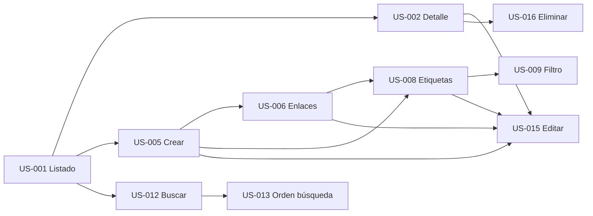

# 📋 Plan de implementación — Organizador de Conocimiento

**Versión:** 1.0  
**Alcance:** MVP  
**Fuente:** LLD-v1, user stories enriquecidas, PRD-v1, HLD-v1  
**Autor:** Implementation Planner Agent  
**Última actualización:** 4 de julio de 2026

---

## 0. Resumen ejecutivo

Plan de implementación del **MVP** en **8 fases técnicas** (+ bootstrap infra), con **40 tasks** ordenadas en cola global. Cada ítem indica agente desarrollador, capa y dependencias. El orden sigue **slices verticales** del LLD §9.2: dentro de cada fase, **DB → BE → FE → QA**.

| Métrica | Valor |
|---------|-------|
| Historias en alcance | 10 (US-001, US-002, US-005, US-006, US-008, US-009, US-012, US-013, US-015, US-016) |
| Tasks en cola | 40 |
| Fases de entrega | 8 (+ bootstrap) |
| Duración estimada | 4–6 sprints (equipo académico) |

**Cola ejecutable:** [`implementation-queue-v1.json`](implementation-queue-v1.json)

**Primer ítem a implementar:** `sequence: 1` → **TASK-019** (tabla `notas`).  
**Pre-requisito manual (PHASE-000):** `docker-compose`, `.env`, endpoint `GET /api/v1/health`.

---

## 1. Objetivo de negocio (MVP)

Entregar un producto usable que permita **capturar, organizar, recuperar y mantener** notas personales sin fricción (PRD §2).

| Objetivo PRD | Historias |
|--------------|-----------|
| Captura ágil (≤ 2 interacciones) | US-005, US-006 |
| Navegar biblioteca personal | US-001, US-002 |
| Organizar por etiquetas | US-008, US-009 |
| Recuperar por búsqueda | US-012, US-013 |
| Mantener información actualizada | US-015, US-016 |

---

## 2. Dependencias entre historias



| Historia | Depende de | Motivo |
|----------|------------|--------|
| US-002 | US-001 | Navegación desde listado al detalle |
| US-005 | US-001 | Verificar nota creada en listado |
| US-006 | US-005 | Enlaces en formulario de creación/edición |
| US-008 | US-005, US-006 | Tags en nota con formulario existente |
| US-009 | US-008 | Filtrar requiere etiquetas asignadas |
| US-012 | US-001 | Resultados de búsqueda en vista de listado |
| US-013 | US-012 | Ordenación sobre resultados de búsqueda |
| US-015 | US-002, US-005, US-006, US-008 | Edición de todos los campos |
| US-016 | US-002 | Eliminar desde detalle |

---

## 3. Fases de implementación

### PHASE-000 — Bootstrap infraestructura

**Objetivo:** Entorno local ejecutable (Postgres + API + SPA).  
**Historias:** —  
**Criterio de cierre:** `docker-compose up`, `GET /api/v1/health` → 200.

| Acción | Agente | Notas |
|--------|--------|-------|
| `src/infra/docker-compose.yml`, Dockerfiles | devops-engineer | LLD §11 |
| `GET /api/v1/health` | backend-engineer | Antes de TASK-019 |
| `.env.example`, `VITE_API_URL` | devops-engineer | |

> Sin TASK en backlog; ejecutar antes de `sequence: 1`.

---

### PHASE-001 — Esquema base y listado (US-001)

**Objetivo:** Listado de notas en pantalla principal.  
**Criterio de cierre:** E2E TASK-004 verde; RNF-001 listado < 2 s.

| Orden | ID | Capa | Agente | Depende de |
|-------|-----|------|--------|------------|
| 1 | TASK-019 | database | backend-engineer | — |
| 2 | TASK-003 | database | backend-engineer | TASK-019 |
| 3 | TASK-001 | backend | backend-engineer | TASK-019, TASK-003 |
| 4 | TASK-002 | frontend | frontend-engineer | TASK-001 |
| 5 | TASK-004 | qa | qa-engineer | TASK-002 |

---

### PHASE-002 — Detalle de nota (US-002)

**Objetivo:** Abrir nota desde listado con enlaces y etiquetas (arrays vacíos si aún no hay datos).  
**Criterio de cierre:** E2E TASK-008; 404 manejado.

| Orden | ID | Capa | Agente | Depende de |
|-------|-----|------|--------|------------|
| 6 | TASK-031 | database | backend-engineer | TASK-019 |
| 7 | TASK-023 | database | backend-engineer | TASK-019 |
| 8 | TASK-005 | backend | backend-engineer | TASK-019, TASK-023, TASK-031 |
| 9 | TASK-007 | database | backend-engineer | TASK-005, TASK-023, TASK-031 |
| 10 | TASK-006 | frontend | frontend-engineer | TASK-005 |
| 11 | TASK-008 | qa | qa-engineer | TASK-006 |

---

### PHASE-003 — Crear nota y enlaces (US-005, US-006)

**Objetivo:** CRUD creación con título, contenido y URLs.  
**Criterio de cierre:** E2E TASK-020, TASK-024; RNF-003 ≤ 2 interacciones.

| Orden | ID | Capa | Agente |
|-------|-----|------|--------|
| 12–17 | TASK-017, 018, 021, 022, 020, 024 | BE/FE/QA | ver cola JSON |

---

### PHASE-004 — Etiquetas (US-008)

**Objetivo:** Asignar etiquetas con auto-creación y unicidad.  
**Criterio de cierre:** TASK-032 verde.

| Tasks | TASK-029, TASK-030, TASK-032 |

---

### PHASE-005 — Filtro por etiqueta (US-009)

**Objetivo:** Filtrar listado por etiqueta.  
**Criterio de cierre:** TASK-036 verde.

| Tasks | TASK-035, TASK-033, TASK-034, TASK-036 |

---

### PHASE-006 — Búsqueda y ordenación (US-012, US-013)

**Objetivo:** Buscar en título/contenido; ordenar por relevancia o fecha.  
**Criterio de cierre:** TASK-048 benchmark RNF-002; TASK-052 orden.

| Tasks | TASK-047, TASK-051, TASK-045, TASK-049, TASK-046, TASK-050, TASK-048, TASK-052 |

---

### PHASE-007 — Editar y eliminar (US-015, US-016)

**Objetivo:** Ciclo de vida completo de la nota.  
**Criterio de cierre:** PUT/DELETE E2E; irreversibilidad del borrado.

| Tasks | TASK-059, TASK-063, TASK-057, TASK-058, TASK-060, TASK-061, TASK-062, TASK-064 |

---

## 4. Cola priorizada global

| # | ID | Historia | Capa | Agente |
|---|-----|----------|------|--------|
| 1 | TASK-019 | US-005 | database | backend-engineer |
| 2 | TASK-003 | US-001 | database | backend-engineer |
| 3 | TASK-001 | US-001 | backend | backend-engineer |
| 4 | TASK-002 | US-001 | frontend | frontend-engineer |
| 5 | TASK-004 | US-001 | qa | qa-engineer |
| 6 | TASK-031 | US-008 | database | backend-engineer |
| 7 | TASK-023 | US-006 | database | backend-engineer |
| 8 | TASK-005 | US-002 | backend | backend-engineer |
| 9 | TASK-007 | US-002 | database | backend-engineer |
| 10 | TASK-006 | US-002 | frontend | frontend-engineer |
| … | … | … | … | … |
| 40 | TASK-064 | US-016 | qa | qa-engineer |

> Cola completa (40 ítems): [`implementation-queue-v1.json`](implementation-queue-v1.json) → `queue[]`.

---

## 5. Reglas de priorización aplicadas

| Regla | Descripción |
|-------|-------------|
| R1 | `TASK-019` (tabla `notas`) antes que cualquier endpoint |
| R2 | Migraciones/índices `[DB]` antes de `[BE]` que las usa |
| R3 | `[BE]` antes de `[FE]` que consume la API |
| R4 | `[QA]` al cierre de cada slice vertical |
| R5 | Esquema enlaces/etiquetas antes de detalle completo (US-002) |
| R6 | Búsqueda (US-012) después de listado estable (US-001) |
| R7 | Edición/eliminación al final (requieren CRUD completo) |

---

## 6. Invocación de agentes desarrollador

### Obtener siguiente task

```bash
jq '.queue[] | select(.status == "backlog") | .sequence as $s | .id as $id | "\($s) \($id)"' docs/engineering/implementation-queue-v1.json | head -1
```

### Prompt recomendado

```
Implementa TASK-019 según docs/engineering/implementation-queue-v1.json
y docs/product/user-stories/US-005.md (sección ### TASK-019).
Actualiza status a done en implementation-queue-v1.json y status-v1.json.
```

### Tras completar cada task

1. Marcar `"status": "done"` en `implementation-queue-v1.json` → `queue[sequence-1]`
2. Marcar misma task en `docs/product/user-stories/status-v1.json`
3. Cuando todas las tasks de una US estén `done`, valorar marcar la historia `done`

---

## 7. Riesgos y mitigaciones

| Riesgo | Impacto | Mitigación |
|--------|---------|------------|
| Bootstrap infra retrasado | Bloquea TASK-019 | PHASE-000 explícita antes de cola |
| US-002 requiere tablas M:N antes de tiempo | Complejidad temprana | TASK-031/023 en fase 2 con datos vacíos |
| Benchmark RNF-002 falla | No cumple PRD | TASK-048 con dataset 500 notas; índice TASK-047 |
| Scope creep V1 | Retraso MVP | Cola excluye US-003, US-007, US-010, US-014 |

---

## 8. Fuera de alcance (este plan)

- US-003, US-007, US-010, US-014 (V1)
- US-004, US-011, US-017 (V2+)
- OpenAPI `api-spec-v1.yaml` (opcional post-MVP)
- Autenticación multi-usuario

---

*Generado con el agente Implementation Planner a partir de `docs/architecture/lld/LLD-v1.md`, user stories enriquecidas MVP y `knowledge/templates/engineering/implementation-plan-template.md`.*
