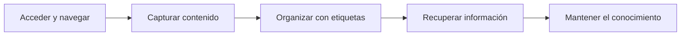

# 🗺 User Story Map — Organizador de Conocimiento (Notion Simplificado)

**Versión:** 1.0  
**Fuente:** `knowledge/product/prd_v1.md`  
**Persona principal:** Usuario final — persona que captura, organiza y recupera notas, enlaces e ideas personales de forma individual.

---

## 0. Visión del mapa

Este mapa traduce el PRD del Organizador de Conocimiento en un viaje de usuario de punta a punta: **acceder → capturar → organizar → recuperar → mantener**. Las historias se priorizan en slices verticales (MVP, V1, V2+) para entregar primero un flujo mínimo usable —crear notas, etiquetarlas, buscarlas y mantenerlas— sin incluir funcionalidades futuras del PRD (backlinks, grafo, plugins).

> El User Story Map organiza el producto en **tres niveles** (método Jeff Patton):
> 1. **Backbone** — fases del viaje del usuario (horizontal, orden temporal)
> 2. **Activities** — acciones concretas dentro de cada fase
> 3. **Stories** — historias de usuario priorizadas en **slices verticales** (MVP → V1 → V2+)

---

## 1. Backbone (User Journey)

Orden de izquierda a derecha = flujo natural del usuario.

| # | Fase del viaje | Objetivo del usuario en esta fase |
|---|----------------|-----------------------------------|
| 1 | Acceder y navegar | Orientarse en su biblioteca personal y abrir el contenido que le interesa |
| 2 | Capturar contenido | Registrar ideas, notas y enlaces de forma rápida antes de que se pierdan |
| 3 | Organizar con etiquetas | Clasificar el conocimiento para encontrarlo por contexto o tema |
| 4 | Recuperar información | Localizar notas concretas mediante búsqueda y exploración de resultados |
| 5 | Mantener el conocimiento | Actualizar o depurar notas obsoletas para mantener la biblioteca útil |

### Diagrama del backbone

---

## 2. Story Mapping

> **Reglas de redacción (INVEST):** Independiente · Negociable · Valiosa · Estimable · Pequeña · Testeable  
> **Formato obligatorio:** *Como* [usuario], *quiero* [acción], *para* [valor/beneficio]

---

### 2.1 Acceder y navegar

#### Activities
- Abrir la aplicación y revisar el listado de notas existentes
- Seleccionar una nota para ver su contenido completo

#### User Stories

| ID | Prioridad | Historia de usuario | Criterios de aceptación (resumen) |
|----|-----------|---------------------|-----------------------------------|
| US-001 | MVP | Como usuario final, quiero ver un listado de todas mis notas, para orientarme rápidamente en mi biblioteca personal. | Se muestran todas las notas con título y fecha; listado visible al abrir la app (RF-015). |
| US-002 | MVP | Como usuario final, quiero abrir el detalle de una nota desde el listado, para leer su contenido completo. | Al pulsar una nota se muestra título, contenido, enlaces y etiquetas (RF-004, RF-016). |
| US-003 | V1 | Como usuario final, quiero ver un mensaje claro cuando aún no tengo notas, para saber cómo empezar a capturar contenido. | Estado vacío con llamada a la acción "Crear nota"; sin pantalla en blanco sin contexto. |
| US-004 | V2+ | Como usuario final, quiero ordenar el listado por fecha o título, para priorizar cómo reviso mi biblioteca. | Selector de ordenación; el orden se mantiene en la sesión actual. |

---

### 2.2 Capturar contenido

#### Activities
- Crear una nota nueva con título y contenido
- Añadir enlaces de referencia a recursos externos

#### User Stories

| ID | Prioridad | Historia de usuario | Criterios de aceptación (resumen) |
|----|-----------|---------------------|-----------------------------------|
| US-005 | MVP | Como usuario final, quiero crear una nota con título y contenido en máximo 2 interacciones, para capturar ideas sin fricción. | Botón "Nueva nota" → formulario → guardar; título y contenido obligatorios; fechas auto-generadas (RF-001, RF-003, RNF-003). |
| US-006 | MVP | Como usuario final, quiero añadir enlaces URL a una nota, para conservar referencias junto a mis ideas. | Se pueden añadir una o más URLs al crear o editar; URLs inválidas rechazadas con mensaje (RF-002, RNF-008). |
| US-007 | V1 | Como usuario final, quiero recibir feedback inmediato si olvido el título o el contenido, para corregir el error sin perder lo escrito. | Validación en cliente/servidor; mensaje específico por campo; datos del formulario no se pierden. |

---

### 2.3 Organizar con etiquetas

#### Activities
- Asignar etiquetas temáticas a las notas
- Filtrar el listado por una etiqueta concreta

#### User Stories

| ID | Prioridad | Historia de usuario | Criterios de aceptación (resumen) |
|----|-----------|---------------------|-----------------------------------|
| US-008 | MVP | Como usuario final, quiero asignar etiquetas a una nota, para clasificar mi conocimiento por temas. | Etiquetas creadas automáticamente al escribirlas; varias etiquetas por nota; nombre único por usuario (RF-007, RF-008, RF-009). |
| US-009 | MVP | Como usuario final, quiero filtrar mis notas por una etiqueta, para ver solo el contenido de un tema concreto. | Al seleccionar etiqueta, el listado muestra solo notas asociadas; mensaje si no hay resultados (RF-011, RF-017). |
| US-010 | V1 | Como usuario final, quiero quitar una etiqueta de una nota sin borrar la nota, para reorganizar sin perder contenido. | Acción "quitar etiqueta" en detalle/edición; la nota permanece; la etiqueta sigue existiendo si otras notas la usan (RF-010). |
| US-011 | V2+ | Como usuario final, quiero ver un listado de todas mis etiquetas con conteo de notas, para entender cómo está distribuido mi conocimiento. | Panel de etiquetas con nombre y número de notas asociadas. |

---

### 2.4 Recuperar información

#### Activities
- Buscar notas por palabra clave en título y contenido
- Revisar y ordenar los resultados de búsqueda

#### User Stories

| ID | Prioridad | Historia de usuario | Criterios de aceptación (resumen) |
|----|-----------|---------------------|-----------------------------------|
| US-012 | MVP | Como usuario final, quiero buscar notas por un término de texto, para encontrar información sin recordar dónde la guardé. | Búsqueda en título y contenido; resultados en < 300 ms con < 500 notas (RF-012, RF-013, RNF-002). |
| US-013 | MVP | Como usuario final, quiero ordenar los resultados de búsqueda por relevancia o fecha, para priorizar lo más útil. | Selector relevancia/fecha; el orden se aplica al listado de resultados (RF-014). |
| US-014 | V1 | Como usuario final, quiero un mensaje claro cuando la búsqueda no devuelve resultados, para saber que debo probar otros términos. | Texto "Sin resultados para [término]"; sin error técnico visible; campo de búsqueda editable. |

---

### 2.5 Mantener el conocimiento

#### Activities
- Editar el contenido de notas existentes
- Eliminar notas que ya no son relevantes

#### User Stories

| ID | Prioridad | Historia de usuario | Criterios de aceptación (resumen) |
|----|-----------|---------------------|-----------------------------------|
| US-015 | MVP | Como usuario final, quiero editar una nota existente, para mantener mi información actualizada. | Todos los campos editables; `updated_at` se actualiza al guardar; respuesta < 2 s (RF-005, RNF-001). |
| US-016 | MVP | Como usuario final, quiero eliminar una nota permanentemente, para depurar contenido obsoleto. | Confirmación antes de eliminar; nota desaparece del listado; operación irreversible (RF-006). |
| US-017 | V2+ | Como usuario final, quiero enlazar una nota con otra (backlink), para navegar relaciones entre ideas. | Crear referencia a otra nota; ver notas que enlazan a la actual; fuera de alcance MVP según PRD. |

---

## 3. Release Slices (vista horizontal)

> Cada **slice vertical** atraviesa el backbone y entrega un incremento usable de extremo a extremo.

### MVP — Captura, organización y recuperación básica

| Backbone | Historias incluidas |
|----------|---------------------|
| Acceder y navegar | US-001, US-002 |
| Capturar contenido | US-005, US-006 |
| Organizar con etiquetas | US-008, US-009 |
| Recuperar información | US-012, US-013 |
| Mantener el conocimiento | US-015, US-016 |

**Viaje habilitado:** El usuario abre la app, ve sus notas, crea una nueva con enlaces opcionales, la etiqueta, la busca, la edita y la elimina si lo necesita.

**Por qué es suficiente para el lanzamiento inicial:** Cubre el ciclo completo capturar → organizar → recuperar → mantener definido en el PRD, cumple los 6 casos de uso MVP (CU-001 a CU-006) y los criterios de aceptación sin backlinks, grafo ni plugins.

---

### V1 — Pulido de experiencia

| Backbone | Historias incluidas |
|----------|---------------------|
| Acceder y navegar | US-003 |
| Capturar contenido | US-007 |
| Organizar con etiquetas | US-010 |
| Recuperar información | US-014 |

**Valor incremental:** Mejora la experiencia en estados vacíos, validación de formularios, gestión fina de etiquetas y feedback de búsqueda sin ampliar el alcance funcional del núcleo.

---

### V2+ — Evolución del producto

| Backbone | Historias incluidas |
|----------|---------------------|
| Acceder y navegar | US-004 |
| Organizar con etiquetas | US-011 |
| Mantener el conocimiento | US-017 (+ grafo, plugins, auth según PRD sección 8) |

**Valor incremental:** Ordenación avanzada, vista de catálogo de etiquetas, backlinks y capacidades planificadas en el roadmap del PRD (grafo de conocimiento, plugins, multi-usuario).

---

## 4. MVP Slice Summary

### Historias MVP (lista consolidada)

| ID | Historia | Fase backbone | Trazabilidad PRD |
|----|----------|---------------|------------------|
| US-001 | Como usuario final, quiero ver un listado de todas mis notas, para orientarme rápidamente en mi biblioteca personal. | Acceder y navegar | RF-015 |
| US-002 | Como usuario final, quiero abrir el detalle de una nota desde el listado, para leer su contenido completo. | Acceder y navegar | RF-004, RF-016 |
| US-005 | Como usuario final, quiero crear una nota con título y contenido en máximo 2 interacciones, para capturar ideas sin fricción. | Capturar contenido | RF-001, RF-003, RNF-003 |
| US-006 | Como usuario final, quiero añadir enlaces URL a una nota, para conservar referencias junto a mis ideas. | Capturar contenido | RF-002 |
| US-008 | Como usuario final, quiero asignar etiquetas a una nota, para clasificar mi conocimiento por temas. | Organizar con etiquetas | RF-007, RF-008, RF-009 |
| US-009 | Como usuario final, quiero filtrar mis notas por una etiqueta, para ver solo el contenido de un tema concreto. | Organizar con etiquetas | RF-011, RF-017 |
| US-012 | Como usuario final, quiero buscar notas por un término de texto, para encontrar información sin recordar dónde la guardé. | Recuperar información | RF-012, RF-013, RNF-002 |
| US-013 | Como usuario final, quiero ordenar los resultados de búsqueda por relevancia o fecha, para priorizar lo más útil. | Recuperar información | RF-014 |
| US-015 | Como usuario final, quiero editar una nota existente, para mantener mi información actualizada. | Mantener el conocimiento | RF-005, RNF-001 |
| US-016 | Como usuario final, quiero eliminar una nota permanentemente, para depurar contenido obsoleto. | Mantener el conocimiento | RF-006 |

**Total MVP:** 10 historias de 17 (~59 %), alineado con la guía de priorización del 60–70 %.

### Métricas de éxito del slice MVP

- Creación de nota completada en ≤ 2 interacciones desde pantalla principal (RNF-003).
- Operaciones CRUD y navegación con respuesta < 2 s en el 95 % de casos (RNF-001).
- Búsqueda < 300 ms con hasta 500 notas; resultados relevantes en título y contenido (RNF-002, métricas PRD §10).
- Cero pérdidas de datos tras recarga de aplicación (RNF-004).

---

## 5. Assumptions

- Un único usuario por instancia; sin autenticación en MVP (PRD §4).
- Interfaz en español y acceso vía navegador web moderno (PRD §4, RNF-007).
- Volumen de datos < 1 000 notas; búsqueda con mecanismo estándar de BD es suficiente (PRD §4).
- Los enlaces se almacenan como URL sin comprobar si el recurso remoto está activo (PRD §4).

---

## 6. Risks

| Riesgo | Impacto | Mitigación |
|--------|---------|------------|
| Scope creep: incluir backlinks o grafo en MVP | Retraso y sobreingeniería | Historias US-017 y V2+ explícitamente fuera del slice MVP; alineado con PRD §8 |
| Búsqueda insatisfactoria con SQL básico | Usuarios no recuperan notas | US-012/US-013 con criterios medibles; índices en título/contenido; evaluar full-text en V1 |
| MVP demasiado grande (10 historias) | Retraso en entrega | Slice vertical ya definido; historias INVEST y pequeñas; V1 para pulido UX |
| Confundir tareas técnicas con historias de usuario | Mapa poco útil para negocio | Todas las historias redactadas desde perspectiva del usuario final |

---

## 7. Out of Scope (recordatorio)

> Historias o funcionalidades **explícitamente excluidas** del mapa actual (no confundir con V2+ planificado).

- Autenticación, multi-usuario y roles de administrador (PRD §3.1, futuro).
- Grafo de conocimiento visual y sistema de plugins (PRD §8 Futuro).
- Importación/exportación masiva (Markdown, Notion) y búsqueda full-text avanzada.
- Adjuntos de archivos, sincronización offline y colaboración en tiempo real.

---

*Generado con el agente User Story Mapping Generator a partir de `knowledge/product/prd_v1.md` y `knowledge/templates/product/user_story_mapping_template.md`.*
